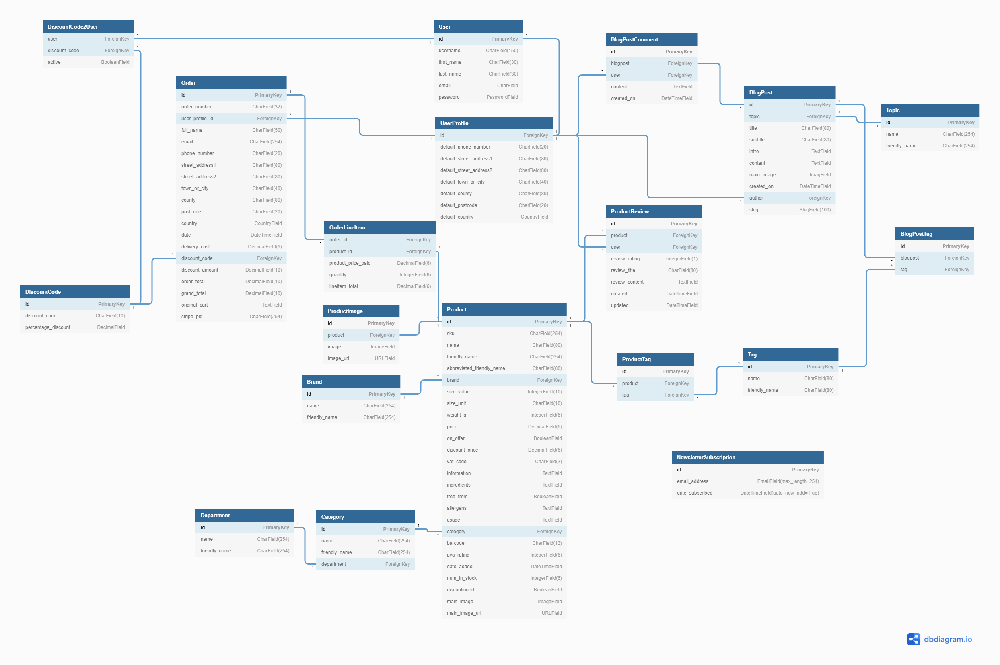
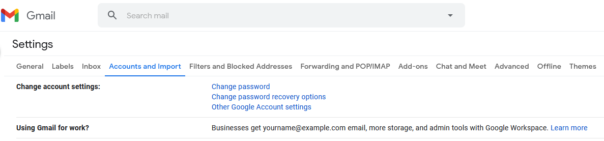
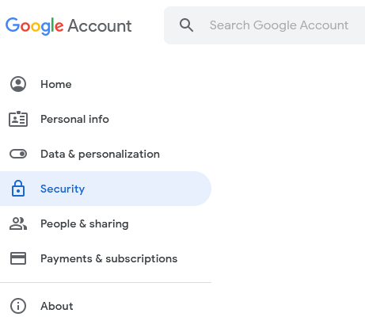

<h1 align="center">Dargan Health Foods</h1>


<sub>_Created using_ [Am I Responsive](http://ami.responsivedesign.is/)</sub>
<br>

Dargan Health Foods is an e-commerce website, which was built for the independently-owned health-food store of the same name,
based in Castletroy Shopping Centre in Limerick.

The site is aimed at health-conscious and environmentally-conscious consumers.
These individuals are concerned with nutrition, fitness, and the environment and wish
to lead a 'wellness-oriented' lifestyle by purchasing health-related products.

This project was created to satisfy the final Milestone Project requirements of the Full
Stack Web Development Program at the [Code Institute](https://codeinstitute.net/).
This full-stack website, with its fully-implemented authentication mechanism and
payment system and control of a centrally-owned dataset, was constructed using
[HTML5](http://en.wikipedia.org/wiki/HTML5), [CSS3](http://en.wikipedia.org/wiki/CSS),
[JavaScript](https://en.wikipedia.org/wiki/JavaScript), the JavaScript library
[jQuery](https://jquery.com/) , [Python](<https://en.wikipedia.org/wiki/Python_(programming_language)>),
[Django](https://www.djangoproject.com/), [Heroku Postgre](https://www.heroku.com/postgres) database
and the [Stripe](https://stripe.com/) payment platform.

To test the site's checkout process please use the test credit card number provided in
the [Stripe Documentation](https://stripe.com/docs/testing):

- Card Number: 4242 4242 4242 4242
- Expiration Date: Any date (e.g. 02/04)
- CVC: Any three digits

<br>

Click <a href="https://dargan-health-foods.herokuapp.com/">here</a> to visit the deployed site.

<br>

## **Table of Contents**

1. [**User Experience (UX)**](#ux)
   - [Project Goals](#project-goals)
   - [User Stories](#user-stories)
     - [Prospective User](#prospective-user)
     - [Existing User](#existing-user)
     - [Site Owner](#site-owner)
2. [**User Centered Design**](#user-centered-design)
   - [1) The Strategy Plane](#1-strategy-plane)
   - [2) The Scope Plane](#2-scope-plane)
   - [3) The Structure Plane](#3-structure-plane)
     - [Planning](#planning)
     - [Existing Features](#existing-features)
       - [Favicon](#favicon)
       - [Title](#title)
       - [Navbar](#navbar)
       - [Toast Messages](#toast-messages)
       - [Breadcrumbs Navigational Links](#breadcrumbs-navigational-links)
       - [Pagination Links](#pagination-links)
       - [Product and BlogPost Cards](#product-and-blogpost-cards)
       - [Free Delivery Banner](#free-delivery-banner)
       - [Newsletter Subscription Form](#newsletter-subscription-form)
       - [Footer](#footer)
       - [Home Page Features](#home-page-features)
       - [Our Story Page Features](#our-story-page-features)
       - [Contact Us Page Features](#contact-us-page-features)
       - [Products Page Features](#products-page-features)
       - [Product Detail Page Features](#product-detail-page-features)
       - [Add Product Page Features](#add-product-page-features)
       - [Edit Product Page Features](#edit-product-page-features)
       - [Add Product Review Page Features](#add-product-review-page-features)
       - [Edit Product Review Page Features](#edit-product-review-page-features)
       - [Cart Page Features](#cart-page-features)
       - [Checkout Page Features](#checkout-page-features)
       - [Checkout Success Page Features](#checkout-page-features)
       - [My Account Page Features](#my-account-page-features)
       - [Blog Page Features](#blog-page-features)
       - [BlogPost Page Features](#blogpost-page-features)
       - [Add BlogPost Page Features](#add-blogpost-page-features)
       - [Edit BLogPost Page Features](#edit-blogpost-page-features)
       - [Add BlogComment Page Features](#add-blogpost-comment-page-features)
       - [Edit BlogComment Page Features](#edit-blogpost-comment-page-features)
       - [Custom 404 and 500 Page Features](#custom-404-and-500-page-features)
       - [Authorisation Pages Features](#authorisation-pages-features)
     - [Features Left to Implement](#features-left-to-implement)
   - [4) The Skeleton Plane](#4-skeleton-plane)
     - [Wireframes](#wireframes)
   - [5) The Surface Plane](#5-surface-plane)
     - [Design](#design)
     - [Colour Scheme](#colour-scheme)
     - [Icons](#icons)
     - [Typography](#typography)
3. [**Development**](#development)
   - [Information Architecture](#information-architecture)
     - [Data Schema](#data-schema)
     - [Data Models](#data-models)
4. [**Technologies Used**](#technologies-used)
5. [**Testing**](#testing)
6. [**Deployment**](#deployment)
   - [Local Deployment](#local-deployment)
   - [Heroku Deployment](#heroku-deployment)
7. [**Credits**](#credits)
   - [Content](#content)
   - [Media](#media)
   - [Acknowledgements](#acknowledgements)

<br>

---

## UX

The Covid-19 crisis has focused attention on online shopping out of necessity.
Rigid social distancing restrictions and the closure of various types of business
has focused consumers’ minds on the ways in which they can get their desired
products and services online.

Dargan Health Foods website is of direct interest to Dargan's regular customers
as well as health-conscious consumers in the Limerick area and beyond.
The site seeks to provide this target market with the ability to view Dargan's
wide range of health foods, eco-friendly and organic products in an online setting.
Through the provision of product descriptions and a product-rating mechanism
the site aims to help users make more informed choices about their purchases.
The inclusion of the Stripe payment processing platform allows customers to
purchase their desired goods. The store also publishes blog posts about
nutrition, healthy-lifestyle tips, recipes, superfood trends and other
items of interest to health-conscious consumers.

Membership of the site provides users with the ability to access their order history,
billing and delivery details. These details are then used to facilitate a faster
and more convenient checkout process for the site member, by
prefilling the necessary forms for them on the Checkout Page.
Members also have the ability to contribute to the site, writing
reviews of products and commenting on the site’s blog posts.
These reviews and comments can subsequently be edited or deleted by their creators.

Dargan's owners see a need to provide their customer base with a
fluid and intuitive remote-shopping experience
that will negate the need for them to visit the physical store
and enable the company to connect with customers
they wouldn’t normally reach, increasing the business’ profitability.  
This website has been designed to work in tandem with the retailer's
physical store and advance their business goals.

### Project Goals

The goals of this project are to:

- Create a credible e-commerce store for Dargan Health Foods with a professional and intuitive interface.
- Create a website that is visually appealing and fully responsive on all devices and screen sizes.
- Present information about Dargan Health Foods website, physical store, brand ethos, products and services so that visitors immediately comprehend what it provides to its customers and members.
- Enable site visitors to select the products they wish to buy, alter the quantity if desired and pay for their items with ease.
- Allow site visitors to easily contact the store with any questions.
- Encourage new members to sign up to the website community.
- Create an interactive website where a community of engaged consumers can share their product reviews and blog comments on the site.
- Provide users with the functionality so that they can create, read, update and delete their own content.
- Store the users’ data, if they permit, so that it is can be accessed when required.

##### back to [top](#table-of-contents)

---

### User Stories

#### Prospective User

I am a prospective Dargan Health Foods site member I want to be able to:

- Immediately comprehend the purpose behind the Dargan Health Foods site.
- Identify where the physical store is located.
- Easily see what products are available.
- Search for specific products by name or category.
- Sort products by category, price or alphabetically.
- Filter search results by allergen or other tag, e.g. organic, vegan.
- Be presented with an image of the product itself.
- Be able to read a description of a each product.
- Be presented with nutritional information or ingredients where applicable.
- Read site members’ product reviews.
- Add products to my shopping cart with ease.
- Be presented with a constant visual reminder of my shopping cart total and number of items already added.
- Be able to edit my shopping cart, increasing or decreasing the quantity of a specific item or deleting it altogether, at will.
- Pay for my items using a secure credit-card payment system.
- Receive immediate visual feedback when my payment has been accepted.
- Receive an email confirming my purchase, order and delivery details.
- Read Dargan Health Foods' blog posts.
- Easily get in contact with the store if I have any questions.
- Easily locate any social media accounts connected to the site.
- Navigate through the site with ease.
- Easily find information outlining the features that membership of the site offers to its registered users.
- Easily register to become a site member.

#### Existing User

I am an existing Dargan Health Foods site member I want to be able to:

- Log in to the site.
- Navigate through the site with ease.
- Log out of the site.
- Edit my account information.
- Take advantage of my site membership by applying discount codes.
- Purchase my desired products using a secure online payment system.
- Receive an order confirmation email.
- View my order history.
- Search for a product by entering a brand name, product name, allergen or other pertinent keyword into a search box within the site.
- Search for a product by department, e.g. Hair & Beauty, Vitamins & Supplements, Special Offers.
- Sort search results, by price, alphabetically or by rating.
- Filter products by allergen or other pertinent tags.
- See images of the product packaging.
- Read detailed descriptions of products.
- Read reviews of products written by site members.
- Leave a review of a product that I have previously purchased through the site.
- Input my review easily into a user-friendly form that is straightforward to use.
- Edit or delete my own reviews.
- Be secure in the knowledge that no other user can edit or delete my reviews.
- Be secure in the knowledge that measures have been put in place to prevent me from accidentally deleting one of my own reviews.
- Contact the store owner.
- Easily locate any social media accounts connected to the site.
- Navigate with ease to the site's blog.
- Search for a blog post by title or keyword.
- Comment on a blog post.
- Edit or delete my own comments.

#### Site Owner

As the owner of Dargan Health Foods website I would like to:

- Provide users with an effective and user-friendly platform where they can see what products Dargan's have to offer.
- Provide site users with a straight-forward online shopping experience.
- Provide visitors with visually appealing images of the products on offer.
- Provide visitors with information about the products, such as their ingredients/nutritional information
  (where applicable), so that they can make more informed choices when choosing their products.
- Provide site users with an easy way to add their desired product to their cart.
- Provide users with a visual representation of their cart total and the number of products already added, visible on all screens.
- Provide users with an updated total when they add or remove products from their cart.
- Provide users with an easy-to-use and secure online payment process.
- Provide site users with product reviews written by site members.
- Provide site members with a user-friendly way to share their own reviews of products, edit those reviews or delete them as they see fit.
- Present the reviews in a visually appealing format.
- Provide site members with the ability to search the site for a specific product by entering the name or the brand into a search box within the site.
- Enable filtering of search results by allergen or other pertinent tags.
- Encourage more users to sign up to become members of the Dargan community by creating a professional-looking website that is intuitive to use.
- Provide prospective members with the ability to sign-up easily.
- Encourage more visitors to follow the site on social media and thereby raise the profile of the store.
- Provide visible contact details so that all site visitors can contact the store with ease.
- Be able to add new products to the online website with ease.
- Edit existing product information with ease.
- Indicate to customers when a product is out of stock.
- Delete and/or discontinue products that are no longer available, removing their images and information from the website.
- Easily add a new blog post to the site blog.

<br>

##### back to [top](#table-of-contents)

---

## User Centered Design

### 1 Strategy Plane

The User Stories above were used to maintain a focus on user needs and business
goals during the design process.

The website is a Business to Consumer model aimed at a health-conscious audience.

In a recent market research blog,
[Key Consumer Trends Powering the Plant-Based Market](https://blog.marketresearch.com/key-consumer-trends-powering-the-plant-based-market),
Sarah Schmidt identified consumer commonalities between vegetarians, vegans and other
diet-conscious demographics. These consumers tend to have higher incomes and therefore
can afford more premium foods and are more willing to pay for
higher-quality products such as sustainable and clean-label foods.
They are younger consumers, including Generation Z adults and Millennials, who value
fresh, healthy foods and are open to trying new products. This category of consumers
also includes a significant proportion of parents of young children who care about
nutrition, natural skincare and household products and the environmental impact of
their choices. As these consumers tend to skew younger, they are already accustomed
to using apps or websites to make purchases, therefore a 'mobile-first' design
approach was adopted.

The main goals of the website include providing site visitors with a visually
appealing, easily navigable website that showcases the range of products
provided by Dargan Health Foods. The new website makes it easier for customers
to find products they are looking for and also research products before potentially
buying them in store. The website aims to raise revenue for the store and
facilitate their housebound-customers' needs by providing site visitors
with a way to purchase their favourite Dargan's products online.
Consumers who have €35 worth of products in their shopping cart will be
encouraged to spend an extra €15 to get free shipping at €50.

Visitors are encouraged to become site members in order to take advantage of
an introductory offer of 10% off their first purchase and to be able to access a  
faster and more convenient checkout process. The inclusion of the site blog, with
regular posts on food and health-related content, of interest to our target audience,
has been designed with a view to encourage visitors to return to the site regularly
and ultimately drive more sales. Dargan’s blog posts will also provide value to their
customers. The blog will be a repository of high-quality information about current
food trends, diets, recipes and more. References to products sold in the store
will have links to that product page allowing the consumer to access more
detailed information about the item and making it easier for them to purchase
the product if they so wish.

Dargan's website aims to provide the company with a robust ordering system that
can be updated in real time. With uncertain supply chains, automatic 'Out of Stock'
labels and disabled purchasing buttons are helpful to both customers and administrators
alike so that customers can’t place an order that can’t be fulfilled. Dargan's website
superusers can easily add or remove products so that their website accurately
reflects the products available.

Social networking sites are a great place for spreading the word about deals,
events and other promotions. Dargan Health Food website allows the business to increase
the reach and influence of their existing social media presence by providing visible
Facebook and Instagram links in the Footer on each page.

With more consumers shopping online and an increasing number of those seeking to
shop locally and support Irish businesses the local and personal nature of the
service in Dargans is communicated through the About Us section on the Home Page, the
Our Story page and through the Blog. It is hoped that the site will help Dargan's
reach a wider audience and develop a long-term relationship with their membership.

##### back to [top](#table-of-contents)

---

### 2 Scope Plane

The key features of the website were developed based on user needs.

Users should be able to do the following on the website:

- Find out information about the site’s services.
- Learn more about the store, its staff and its ethos.
- See where the physical store is located.
- See the contact details and opening hours for the store.
- Contact the store with any queries.
- Easily access the site’s social media channels.
- Learn about the benefits of becoming a Dargan Health Foods site member.
- Sign up to become a member.
- Log in to the site.
- Log out of the site.
- Search the site for a product by name, brand or category.
- Sort search results by rating, price or alphabetically.
- Filter search results by allergen or other relevant tag.
- See an image of the product packaging.
- Read a description of the product.
- Read the ingredient list or nutritional information relating to a specific food product.
- Read other site members' reviews of products.
- Upload a product review for a product they themselves purchased through the site.
- Edit or delete their own product reviews.
- Add a product to their cart.
- See an up-to-date cart total and number of products in their cart at all times.
- Remove a product from their cart.
- Update the quantity of a specific product in their cart.
- Pay for their items.
- Receive immediate visual feedback that their payment has been processed and their order confirmed.
- Receive an email confirming their order.
- See their order history.
- Read the site blog.
- Search for a blog entry of interest by title, keyword or date.
- Upload a comment on a site blog post.
- Edit or delete their own blog post comments.

<br>

##### back to [top](#table-of-contents)

---

### 3 Structure Plane

#### Planning

Research of competing online health-food stores including
[Full Of Beans](https://www.fullofbeans.ie/),
[Health Matters](https://healthmatters.ie/),
[Holland & Barrett](https://www.hollandandbarrett.ie/),
[Down to Earth](https://downtoearth.ie/),
[Nourish](https://www.nourish.ie/),
[The Health Store](https://www.thehealthstore.ie/),
[iHerb](http://www.iherb.com) and
[EverGreen](https://www.evergreen.ie/),
revealed structural commonalities that Dargan Health Foods would be expected to
follow in order to create an intuitive shopping experience for the seasoned
online health-food consumer.

The most prominent navigation buttons on the mobile navbar in these sites, visible
at all times, were the

- **site logo** which operates as a **Home Button**,
- the **dropdown menu toggle**, which reveals and hides the other menu items,
- the **User Profile icon**, allowing users to **login**/**logout** or **access their account**,
- the **Search icon or bar** and
- the **Shopping Cart**.

These links were therefore given priority on the mobile navbar.


Ease of navigation through the provision of categorisation and sub-categorisation
of products was identified as being a high priority for the end user. The mobile
dropdown menu on the Dargan Health Foods website provides links to the different
**product departments** – Health & Beauty, Vitamins & Supplements etc. that were
identified by the company. These departmental links, in turn, open **submenus**
revealing the different **categories** – Bath & Shower, Body Care, Skincare, etc.,
providing the user with a quick means of narrowing their choice.
**Chevron-down icons** are used to alert the user to the presence of the sub-menu.
The remaining links provide access to the site **Blog**, **About Us** section and
the **Contact Us** page, which were deemed important in the User Stories section above.


In order to make navigation easier for the user, particularly on pages with content
that requires the user to scroll, a **'back-to-top' button** was chosen.


<br>

The desktop version of the navbar uses the space available to display
the **brand logo / home button**, **search bar**, **navigation links**,
**checkout button** and **departmental links** at all times.


Each departmental link opens a dropdown menu containing the different product categories
associated with that department.


A seedling-shaped **favicon**, displayed on the web browser's tab allows the user to
identify the website by sight.
The **Title**, displayed on the web browser's tab at all times, clearly
identifies the site as a health-foods website.

<br>

A common **footer** was laid out with
**social media links**,
**store location**,
**opening hours** and
**contact details** as well as
**commonly-used links**: About Us, Contact Us, Blog, My Account and Search.


<br>

##### back to [top](#table-of-contents)

---

#### Existing Features

Changes in Design

The implemented mobile navbar differs from the planned version
in that there is no brand heading above the icons.
As the navbar is fixed this would have used up valuable screen
real estate.

The implemented footer does not contain the planned
Google Maps iframe. Instead it was decided to
use the postal address as an external link to the shop's
location on the Google Maps website. This provides a cleaner,
more consistent design across the footer as a whole, without
compromising on fulfilling site users' needs.

<br>

##### back to [top](#table-of-contents)

---

##### Favicon

A **seedling favicon**, displayed on the web browser's tab
allows the desktop user to identify the website by sight.

<br>

##### back to [top](#table-of-contents)

---

##### Title

The **Title**, displayed on the web browser's tab at all times,
contains the business' title, the shop's location and the current page title.

<br>

##### back to [top](#table-of-contents)

---

##### Navbar

The navbar is fixed so that it is accessible at all times for improved
UX and site navigation.

Mobile Navbar

- The **navbar toggler hamburger icon** opens a dropdown menu with links
  to other pages within the website.

- A border appears around the navbar toggler when it is active.

- Within the dropdown menu **chevron down** icons appear
  next to those **departmental links** which contain
  **category submenus**.

- Dropdown menu links change colour when active.

- The **Account user icon** opens a dropdown menu with links related
  to site membership. This list differs depending on whether the site
  visitor is logged out, logged in or a superuser.

      | Logged-Out User   |Logged-In User |Superuser      |
      | :------------     |:------------  | :------------ |
      | Register          | My Account    | Add Product   |
      | Login             | Logout        | Add BlogPost  |
      |                   |               | My Account    |
      |                   |               | Logout        |

- The **Search magnifying-glass icon** opens the **search bar**
  below the navbar, ensuring that it does not impede navigational functionality.
  Using this input box, the user can search for products by brand name,
  title, ingredient, keyword or tag.

- The **Cart icon** links to the 'Cart' page. The current **Cart Total**
  is displayed below the icon. When items are placed in the cart
  an orange circular **item count indicator** appears on the top
  left of the cart icon and the Cart Total is updated.

<br>

Desktop Navbar

- Link styling on the navbar alters when links are hovered over
  in order to alert the user to their interactive functionality.

- Small navigational links, to frequently needed pages, are rendered on the
  desktop **topnav**. These differ depending on the status of the user.

      | Logged-Out User   |Logged-In User |Superuser      |
      | :------------     |:------------  | :------------ |
      | Our Story         | Our Story     | Our Story     |
      | Blog              | Blog          | Blog          |
      | Contact Us        | Contact Us    | Contact Us    |
      | Sign In           | My Account    | Add Product   |
      | Join              | Logout        | Add BlogPost  |
      |                   |               | My Account    |
      |                   |               | Logout        |

- The website **brand logo**, on the left of the middle nav,
  fulfils user expectations as it operates as a **homepage link**.

- The **search bar** is visible at all times. It allows the user
  to search for a product by brand name, title, ingredient, keyword
  or tag.

- The **minicart** functions as a link to the 'Cart' page when
  there are items in the cart. The **cart icon**,
  **item count** and **cart total** are disabled and appear in muted colours
  when the cart is empty.

- The vibrant orange **Checkout button** operates as a link to the 'Checkout' page
  when there are items within the user's cart. Otherwise it is disabled
  and rendered in a muted cream colour.

- The **main navbar** contains the **departmental dropdown menu links**.
  When clicked, the dropdown menu displayed shows the related **category links**.

<br>

##### back to [top](#table-of-contents)

---

##### Toast Messages

**Toast message boxes** have been used throughout the site to display
alert messages to the user, to provide feedback and to assist them in
achieving their aims. These messages are colour coded for ease of
understanding with **toast cappers** in red for error messages, blue for
informative messages, yellow for warnings and green for success messages.
The universal **times icon** in the top-right-hand-corner of the box
allows the user to close the toast.

<br>

##### back to [top](#table-of-contents)

---

##### Breadcrumbs Navigational Links

To improve the UX **breadcrumbs navigational links** have been provided at
the top of many pages throughout the website. They operate as a kind of
secondary navigation system, indicating to users where they are within
the structure of the site and allowing them to quickly jump to related
pages along the path. Hover effects have been added to the links.
The final 'breadcrumb' in the trail, which indicates the current location,
is not a link.

<br>

##### back to [top](#table-of-contents)

---

##### Pagination Links

**Pagination** has been implemented on the 'Products'
and 'Blog' pages as the amount of content on these pages
varies considerably from request to request.
The items returned are broken into discrete pages
which can be accessed using the **pagination links**
rendered at the bottom of the subset being displayed.
The **left-angle character** brings the user to the 'previous page',
**page numbers** allow users to jump to a numbered page and
the **right-angle character** links to the 'next page' in the series.
The number of links rendered has been capped at three, either
side of the current page. To make the user's current position
explicit, the current page link is styled with a square
green background and white text.

<br>

##### back to [top](#table-of-contents)

---

##### Product and BlogPost Cards

[Bootstrap card components](https://getbootstrap.com/docs/5.0/components/card/)
have been used to display the contents on the
'Products' and 'Blog' pages. For consistency the images and titles on
each card operate as
**links to the associated 'Product Detail' or 'BlogPost' page**.
Hover effects, which change the opacity of the card image
and increase the weight of the title font, alert the user to this functionality.
The content on each card has been kept to a minimum.

Product Cards

- Each Product card displays a **high-quality image of the product itself**.
  A 'no-image-placeholder.svg' is used when no product image is available.

- The **brand name** and **abbreviated product title** are
  printed below the image.

- The **product price** is clearly displayed on each card. If the price has been discounted, the full price
  is rendered in a muted, strikethrough font next to the new discounted price.
  This allows users to see the potential saving at a glance.

- An attractive **offer ribbon**, on the top-right-hand-corner of specific cards
  draws attention to those products which are currently on offer.

- An eye-catching orange **'Add to Cart'** button allows users to add a single unit
  of that item to their shopping cart immediately, negating the need to open the
  associated 'Product Detail' page.

<br>

BlogPost Cards

- Each BlogPost card contains a **colourful photograph** related to the blogpost
  topic. This helps to grab the viewer's attention and to visually communicate the
  content contained within.

- The blogpost **topic**, **date posted** and **title** are printed beneath the image.

- BlogPost cards on the 'Blog' page contain more information than those on the
  'Home' page. Here the first sixty words of the **introductory paragraph** are
  printed in order to give the user a better idea of what the post contains.

- A **'Read Post' text link and animated right-angle character** bring the user to the
  related 'BlogPost' page.

  <br>

##### back to [top](#table-of-contents)

---

##### Free Delivery Banner

This bright apple-green banner appears directly underneath the navbar on all screen sizes.
It informs and reminds customers of the site's free delivery policy.
It has been included on all site pages relating to products or site membership.

<br>

##### back to [top](#table-of-contents)

---

##### Newsletter Subscription Form

This form appears on the 'Home', 'Our Story' and 'Products' pages, where
it was deemed to have been of potential interest to site visitors.
A self-explanatory heading states the purpose of the form.
Subheading text outlines the potential financial benefits to newsletter subscribers.
The form itself consists of a single **input field** with helpful placeholder text
which instructs the user to enter their email address and a **'Subscribe' button**.
Successful submission of the form is communicated to the user in the form of
of a **Toast message box**.

<br>

##### back to [top](#table-of-contents)

---

##### Footer

Mobile Footer

The mobile footer consists of three **accordion elements** which appear automatically
in their collapsed state. The **down chevron icon**
signals that there is hidden content.
Each accordion title operates as a button to
reveal and hide that accordion section's contents. The accordion button's
font colour and background colour change when the accordion is active.
Once open the **up chevron icon** is used to indicate that the button
now functions to close the accordion.

- The 'Find Us' accordion contains the **brand logo** which operates as a
  **link to the homepage**. Beneath that the shop's **postal address** is
  displayed. This is opens an external tab displaying **the shop's location
  on Google Maps**. The shop **phone number** and **email address**
  are both links which will open the associated app on the user's phone.

- The 'Opening Hours' accordion contains the shop's **opening hours**
  displayed in an easy to read table.

- The 'Quick Links' accordion contains **links to frequently needed site
  pages**. These links differ depending on the status of the site visitor.

      | Logged-Out User   |Logged-In User |Superuser      |
      | :------------     |:------------  | :------------ |
      | Our Story         | Our Story     | Our Story     |
      | Blog              | Blog          | Blog          |
      | Contact Us        | Contact Us    | Contact Us    |
      | Sign In           | My Account    | Add Product   |
      | Join              | Logout        | Add BlogPost  |
      |                   |               | My Account    |
      |                   |               | Logout        |

- Beneath the footer accordion is a row containing **social media icons**
  which are links that open the Dargan Health Foods pages on the related
  social media platform.

- Small text containing **copyright** information also links to the current
  business website.

<br>

Desktop Footer

The desktop footer is identical to the mobile footer in that it consists
of three sections, 'Find Us', 'Opening Hours' and 'Quick Links',
displayed horizontally in a row rather than in an
accordion, with the same links and functionality outlined above.

<br>

##### back to [top](#table-of-contents)

---

##### Home Page Features

- A large **Sale Banner** advertises the current marketing strategy. It
  calls the user to take action and 'Shop Now'. The banner fulfills user
  expectations as, when clicked, it brings them to the items on offer. Presently
  this is also the 'Special Offers' page.

- The **New Arrivals** section displays the four latest products to be added to
  the website. Each product is displayed in a **product card**.
  The **'View All New Products' text link and animated right-angle character**
  bring users to a page displaying the latest products in each department.

- The **About Us** section provides a quick overview of the what the shop sells,
  its location and its ethos. The **'Our Story' text link and animated icon**
  bring interested users to the 'Our Story' page where they can read about the
  business' history, owner and staff in more detail.

- The **Latest Posts** section displays two **blogpost cards**
  containing the two latest blog post images, topics, dates and titles.
  The **'View Our Blog' text and animated icon**
  link to the main 'Blog' page.

<br>

##### back to [top](#table-of-contents)

---

##### Our Story Page Features

- **Breadcrumbs navigation links**.

- The article is informative and hopes to entice potential customers
  by humanizing the brand and emphasising Dargan's ethos
  of providing high-quality products and good customer service.

- **Newsletter Subscription Form**.

<br>

##### back to [top](#table-of-contents)

---

##### Contact Us Page Features

- **Breadcrumbs navigation links**.

- The **Contact Us Form** has an informative subheading which outlines the
  purpose of the form. The form itself consists of three fields, with helpful
  placeholder text, which are all required for successful submission.
  The **Your name** and **Your email** inputs are prefilled for logged-in users.
  When the users submits a valid form using the **Send button**
  an email communicating the user's message is sent to the site administrator.
  A **toast message** lets the user know that the message has been sent
  and when to expect a reply.

<br>

##### back to [top](#table-of-contents)

---

##### Products Page Features

- **Breadcrumbs navigation links**.

- A **page title** makes the current selection or categorisation of products explicit.

- The **Item Count** informs the user as to how many products are being displayed
  on the page and the total number of products in the current selection.

- The **'Sort by...' dropdown select box** allows the user to sort the items
  alphabetically, by rating or by price.

- **Product Cards**.

- **Pagination links**.

- **Newsletter Subscription Form**

<br>

##### back to [top](#table-of-contents)

---

##### Product Detail Page Features

- **Breadcrumbs navigation links**.

- Superusers have been provided with **'Edit' and 'Delete' links**
  on each 'Product Detail' page. The **'Edit' link** opens the 'Edit Product'
  page. The **'Delete' link** opens the **'Delete Modal'** where the
  Superuser is asked to confirm their decision by selecting
  the **'Delete' button**. Alternatively they can choose to
  cancel the action by clicking on the **'Retain' button** or by
  dismissing the modal with the **close button**.
  This modal has been included in order to
  prevent accidental deletion of products.

- A high-quality **product image**, where available, is displayed on each 'Product Detail'
  page. Where more than one image exists for a given
  product, they are rendered in an **image carousel**. **Previous and Next controls**
  allow users to browse between the images.

- The **product name** is displayed in a green heading font.

- The **product's average rating** out of five is displayed pictorially in partially,
  or fully filled-in yellow stars.

- The **review rating count** is displayed beside the current star rating.
  This text is a jump-link. When clicked, it opens the 'Customer Reviews' accordion
  and brings the user to that part of the page where they can read the reviews left so far.

- Product **tags**, where they exist, are rendered beneath the **product price**.
  Each tag, if clicked, brings the user to a page of similarly tagged products.

- A **quantity input** allows users to add a specific quantity of the item to
  their cart by inputting the number required and clicking on the **'Add to Cart' button**.

- A general **product description** is visible by default. **Ingredients**,
  **directions for usage**, **product weight** and **allergen information**
  are contained within the **'Details' and 'More Information accordions** further
  down the page.

- Within the **'Disclaimer' accordion** users are reminded
  that the information being displayed may be incorrect.

- The **'Customer Reviews' accordion** contains product reviews currently linked
  to that product. Each review shows the **star rating** awarded, the **review title**,
  the **reviewer's username**, the **review date** and the **review content**. Any
  site visitor who is logged in, has previously purchased the item through
  the Dargan Health Foods website and has not yet left a review
  can see the **'Leave a Review' button**. Author's of reviews can see
  **'Edit' and 'Delete' links** next to their own review.

- The **'Edit link'** opens the 'Edit Review' page.

- The **'Delete' link** next to a review opens a **Delete Modal** in which the user can
  confirm their decision to remove their content from the site or they can cancel
  the action by clicking on the **'Cancel'** button or the modal **'Close'** button.

- **Newsletter Subscription Form**

<br>

##### back to [top](#table-of-contents)

---

##### Add Product Page Features

- Each input and dropdown select box is clearly labelled on
  the **Add Product Form**.

- An **asterisk symbol** has been used
  to indicate which fields are required.

- **Dropdown select boxes**, which greatly speed up the form-filling
  process, have been provided for the 'Brand',
  'On Offer', 'Free From', 'Category', 'Discontinued', and 'Tag' fields.

- The **image field** has been styled as a button which opens
  a dialog box where the user browse to, and select, their desired image.

- A valid form can be submitted using the **'Add Product' button**.

- The **'Cancel' button** redirects the Superuser to the 'All Products' page.

<br>

##### back to [top](#table-of-contents)

---

##### Edit Product Page Features

- The **Edit Product Form** opens prepopulated
  with the information currently in the database.

- Checkboxes next to the 'Current Image' thumbnail
  and each beneath each product 'Tag' allow the Superuser to select
  these items for deletion upon submission of the form.

- Clicking the **'Edit Product' button** submits the
  ammendments to the database.

- The **'Cancel' button** returns the Superuser to
  the 'Product Details' page for that product.

<br>

##### back to [top](#table-of-contents)

---

##### Add Product Review Page Features

- The **Add Review Form** has a **title** to
  remind the user which product they are reviewing.

- The **star rating dropdown** allows them to choose
  their rating by selecting the number of stars to be
  awarded.

- **Placeholder text** informs the user as to what is
  required in each field for successful form
  submission.

- A valid form can be submitted using
  the **'Post Review' button**.

- The **'To Product Page' button** links back to
  the 'Product Detail' page.

<br>

##### back to [top](#table-of-contents)

---

##### Edit Product Review Page Features

- The **Edit Review Form**, entitled
  with the product name, is pre-filled
  with the user's previous submission.
  The **'Update Review' button**
  submits the new review to the database.
  The **'To Product Page' button** links back to
  the related 'Product Detail' page.

<br>

##### back to [top](#table-of-contents)

---

##### Cart Page Features

- The 'Cart' presents the user with a table
  containing the **product image**,
  **product name**, **SKU**, **price** and **quantity** of
  each item within the cart.

- Discounted items display both the full and discounted
  price. The former is presented in strikethrough font to
  remind the user of their saving and to reassure them
  that they are receiving the discounted price.

- **Minus and Plus symbols**
  either side of the quantity displayed allow the user to
  increase or decrease the quantity of that item.
  The **lineitem subtotal** is adjusted accordingly.
  If the quantity is decreased to zero the item is
  removed from the cart.

- Alternatively users can click on
  the **trash can icon** on the end of a product row
  to delete the product from their cart.

- Logged-in users can see the **Promo Code input** and
  **'Apply'** button. When a valid code is submitted
  the promo code is rendered as a
  **[Bootstrap badge](https://getbootstrap.com/docs/5.0/components/badge/)**
  within the cart 'Summary' table. Hover effects and the
  'times' symbol indicate to the user that the code badge,
  and associated discount, can be removed.

- The **'Continue Shopping'** button takes the user to
  'Products' page.

- The cart 'Summary' table displays the **Cart Total**,
  any **discount code and associated value** that has been applied,
  and the **'Shipping' cost**. The **'Order Total'** appears
  in bold text for emphasis. Text, in same blue hue as that used for
  informative toast message cappers, informs the user
  of the current **delivery delta**.

- The **'Secure Checkout' button** brings the user to
  the next step in the checkout process by opening the 'Checkout' page.

<br>

##### back to [top](#table-of-contents)

---

##### Checkout Page Features

- An **order summary** displays a table of the items the user
  has in their cart ready to purchase. The **product image**,
  **name**, **quantity** and **lineitem subtotal** show
  the user exactly what they are purchasing.
  The **'Order Total'**, **discount code and discount amount**
  if applied, the **'Delivery' cost** and the **'Grand Total'**
  provide the user with an overview of their entire order.

- Links to the **Log in** and **Sign Up** pages
  have been provided to encourage the user to sign in or sign up
  to take advantage of a faster checkout process.

- The **Checkout Form** is clearly labelled with placeholder
  text to guide the user.

- Logged-in users can save the
  delivery information to their profile by selecting the
  **checkbox** provided. If information already exists in their
  profile the associated form fields will have been prefilled.

- The **'Adjust Cart'** button directs the user back
  to their 'Cart'.

- The **'Confirm and Pay Now'** button submits the form.

- **[Stripe payments](www.stripe.com)** has been implemented to
  securely manage the credit card transaction.

- A **loading overlay** and **animated spinning icon**
  provide the user with visual feedback that a process is taking
  place.

<br>

##### back to [top](#table-of-contents)

---

##### Checkout Success Page Features

The Checkout Success page provides reassurance to the user that their
purchase has been processed.

- A **toast message** informs the user that
  an 'Order Confirmation Email' has been sent to the email address provided.
  and displays all their order details.

- A **summary of the order, delivery and billing information** is displayed
  on the page.

- The **'Now check out the latest products!'** button links to the
  'All New In' products page.

<br>

##### back to [top](#table-of-contents)

---

##### My Account Page Features

- **Breadcrumbs navigational links**.

- A **tabbed navigational interface** and **navigational pills**
  allow the logged-in user to navigate between their
  'Details', 'Address Book', 'Order History',
  'Product Reviews' and 'Blog Comments' within a single webpage.

- On the 'My Details' pane the user can see their profile information,
  their **username** and **email address**. The **'Change Password'**
  button brings them to the 'Change Password' page.

- The 'My Address Book' pane contains the
  **'Default Delivey Information' table/form**,
  prefilled for users who have previously chosen to save this
  iformation during the checkout process.
  Users can add this information to their account by
  filling out this form and using the **'Update Information' button.**

- The 'My Order History' pane displays a table of the user's previous
  orders, if any exist. The truncated **order number**, **date**,
  **items purchased** and **Order Total** are displayed in rows.
  The blue **Order Number** is a link that brings the user to the
  'Checkout Success' page for that order.

- The 'My Product Reviews' pane contains a table displaying
  each **product reviewed**, the **review date**,
  a pictorial representation of the
  **review rating** in stars out of five and the **review title**.  
  **'Edit'** and **'Delete'** links next to each review provide the
  user with easy access to that functionality (outlined previously).
  The **product name**, presented in green text, is a link to the
  associated 'Product Detail' page.

- The 'My Blog Comments' pane contains a table displaying
  the **blogpost title**, **comment date**,
  a truncated **opening sentence**.  
  **'Edit'** and **'Delete'** links on each table row provide the
  user with easy access to that functionality (outlined above).
  The **blog title**, displayed in green, is a link to the
  associated 'BlogPost' page.

<br>

##### back to [top](#table-of-contents)

---

##### Blog Page Features

- **Breadcrumbs navigation links**.

- A **page title** makes the current selection or categorisation of blogposts explicit.

- The **'Filter Blog By Topic' dropdown select box** allows the user
  to access all blog posts or to selections of blog posts which share a similar topic.

- The **Search input** and **maginifying-glass icon button**
  allow the user to search all blogposts for specific keywords.

- The **Item Count** informs the user as to how many blogposts are being displayed
  on the page and the total number of blogposts in the current selection.

- **BlogPost Cards**.

- **Pagination links**.

<br>

##### back to [top](#table-of-contents)

---

##### BlogPost Page Features

- **Breadcrumbs navigation links**.

- Superusers have been provided with **'Edit' and 'Delete' links**
  on each 'BlogPost' page. The **'Edit' link** opens the 'Edit Post'
  page. The **'Delete' link** opens the **'Delete Modal'** where the
  Superuser is asked to confirm their decision by selecting
  the **'Delete' button**. Alternatively they can choose to
  cancel the action by clicking on the **'Retain' button** or by
  dismissing the modal with the **close button**.
  This modal has been included in order to
  prevent accidental deletion of blogposts.

- A brightly-coloured **photograph**,
  related to the blogpost content, is displayed underneath
  the **title**.

- Metadata, the **author**, **date** and **topic** category, are
  printed above the blogpost **subheading**.

- BlogPost **tags**, where they exist, are rendered after the **tag icon**.
  Each word is a link to bring the user to a page of similarly tagged blogposts.

- The **comment icon** draws attention to the **comment counter**.
  This number is a **jump-link**. When clicked, it opens the 'Comments' accordion
  and brings the user to that part of the page where they can read the
  comments that have been left so far.

- The **'Comments' accordion** contains any blog comments left by site
  members. Each comment shows the **site member's username**,
  the **comment date** and the **comment**.

- Site members, who are logged in, have access to the **'Leave a Comment' button**,
  which has been placed for ease of access at the top of the 'Comments' accordion.

- Visitor's who are not logged in but wish to leave a comment
  are provided with **login** and **register** text links to start the
  process that will enable them to do so.

- Author's of comments can see **'Edit' and 'Delete' links**
  next to their own comment. The **'Edit link'** opens the 'Edit Review' page.
  The **'Delete' link** opens a **Delete Modal** in which the user can
  confirm their decision to remove their comment from the site or they can cancel
  the action by clicking on the **'Cancel'** button or the modal **close button**.

<br>

##### back to [top](#table-of-contents)

---

##### Add BlogPost Page Features

- Each input and dropdown select box is clearly labelled on
  the **Add BlogPost Form**.

- **Asterisk symbols** have been used
  to indicate to the Superuser which fields are required.

- The blogpost 'Topic' and 'Tag' fields have been included as
  **dropdown select boxes**, for a quicker form-filling
  experience.

- The **image field** has been styled as a button which opens
  a dialog box where the user browse to, and select, their desired image.

- A valid form can be submitted using the **'Add BlogPost' button**.

- The **'Cancel' button** redirects the Superuser to the 'Blog' page.

<br>

##### back to [top](#table-of-contents)

---

##### Edit BlogPost Page Features

- The **Edit BlogPost Form** is prefilled with
  the information currently in the database.

- **Checkboxes** next to the 'Current Image' thumbnail
  and each beneath each product 'Tag' allow the Superuser to select
  these items for deletion upon submission of the form.

- Clicking the **'Update BlogPost' button** submits the
  ammended form data to the database.

- The **'Cancel' button** returns the Superuser to
  the 'BlogPost' page.

<br>

##### back to [top](#table-of-contents)

---

##### Add BlogPost Comment Page Features

- The **Add Comment form** displays
  the **title** of the related BlogPost to
  remind the user what they are commenting on.

- The single text field has **placeholder** text
  instructing the user to share their thoughts.

- A valid form can be submitted using
  the **'Upload Comment' button**.

- The **'To Blog Post' button** links back to
  the 'BlogPost' page.

<br>

##### back to [top](#table-of-contents)

---

##### Edit BlogPost Comment Page Features

- The **Edit Comment Form** **title**
  reminds the user of the related BlogPost title.

- The form opens prepopulated with the
  user's comment.

The **'Update Comment' button**
allows the user to submit their
edited comment to the database.

- The **'To Blog Post' button** opens
  the related 'BlogPost' page.

<br>

##### back to [top](#table-of-contents)

---

##### Custom 404 and 500 Page Features

- Both pages have an **in-text link** to bring the user
  back to the **'Home' page**.

<br>

##### back to [top](#table-of-contents)

---

##### Authorisation Pages Features

All authorisation pages including 'Sign Up',
'Login', 'Logout', 'Change Password', 'Reset Password',
'Verify Password' and 'Verification Email Sent' have been
implemented using [Django allauth](https://django-allauth.readthedocs.io/en/latest/installation.html).

- User's can sign up to become members of the site by
  clicking the **'Sign Up'** button on the **Sign Up Form**
  after providing their **email address**, **username**,
  **first name**, **last name**, and **password**. Alternatively
  they can navigate to the 'Login' page using the
  **'Back to Login' button**.

- Clicking the link sent to the submitted email address on
  sign up, brings the user back to the site to the 'Confirm E-Mail Address' page
  where users can confirm the address connected to their account
  and finish the registration process using the **'Confirm' button**.

- Site members can log in by filling out
  the **Username or E-mail** and **Password**
  fields on the **Login Form** and pressing the
  **'Sign In' button**. Alternatively
  they can navigate to the 'Home' page using the
  **'Home' button** or the 'Sign Up' page using the
  **'Create an Account'** link.

- Non-logged in site members can reset their
  password by entering their **email address** into
  the **Password Reset Form** and clicking the
  **'Reset my Password' button**. This sends an
  email with a reset link to the email address provided.
  Alternatively
  users can navigate to the 'Login' page using the
  **'Back to Login' button** provided.

- Logged-in users can change their password
  using the **'Change Password' button** on their
  'My Account' page. This opens the 'Change Password'
  page where they can alter their password by
  inputting their **current password** and then
  entering their **new password** into the clearly labelled
  fields and pressing the **'Change Password'** button.
  A **'My Account' button** links back to their individual
  'Account' page.

- The 'Sign Out' page asks the user to
  confirm their wish to sign out by choosing the
  **'Sign Out' button**. The **'Cancel button**
  redirects to the 'Home' page.

<br>

##### back to [top](#table-of-contents)

---

#### Features Left to Implement

- Reduce a Product's 'Num in Stock' field in the
  database when an order has been processed.
- Add 'Out of Stock' ribbons that will be automatically
  applied to products when the 'Num in Stock' field is reduced to zero.
- Add a full checkout system with separate 'Shipping Address'
  and 'Billing Address' forms.
- Add a 'Free Instore Pickup' option on the new 'Shipping Address' page.
- Remove the 'ZIP Code' from the Stripe card input and
  attach the postal code to the customer's order using JavaScript.
- Add more payment options, including 'Paypal' to improve
  the user experience.
- Add an Order History template rather than reusing the Checkout Success page.
- Add the ability for users to filter blogpost search results.

<br>

##### back to [top](#table-of-contents)

---

### 4 Skeleton Plane

The UI wireframing tool, [Balsamiq](https://balsamiq.com/) was used to create wireframes
for each page as they will appear on mobile, tablet and desktop devices.
Main content areas on each page were designed for functionality and consistency.

To cater to for increasing number of consumers shopping from mobile devices, the site
uses responsive web design.
Dargan Health Foods was designed with a mobile-first design philosophy,
beginning with the product design from the mobile end, which has more restrictions and
then expanding its features to create a tablet and desktop version.

<br>

##### back to [top](#table-of-contents)

---

#### Wireframes

- [Home Page](https://github.com/nualagr/dargan-health-foods/blob/master/documentation/wireframes/index-all-devices.png)
  

- [Login Page](https://github.com/nualagr/dargan-health-foods/blob/master/documentation/wireframes/login-all-devices.png)
  

- [Registration Page](https://github.com/nualagr/dargan-health-foods/blob/master/documentation/wireframes/register-all-devices.png)
  

- [Contact Page](https://github.com/nualagr/dargan-health-foods/blob/master/documentation/wireframes/contact-all-devices.png)
  

- [User Account](https://github.com/nualagr/dargan-health-foods/blob/master/documentation/wireframes/account-all-devices.png)
  

- [Search Results Page](https://github.com/nualagr/dargan-health-foods/blob/master/documentation/wireframes/search-all-devices.png)
  

- [All Products](https://github.com/nualagr/dargan-health-foods/blob/master/documentation/wireframes/products-all-devices.png)
  

- [Individual Product Page](https://github.com/nualagr/dargan-health-foods/blob/master/documentation/wireframes/product-all-devices.png)
  

- [Shopping Cart](https://github.com/nualagr/dargan-health-foods/blob/master/documentation/wireframes/cart-all-devices.png)
  

- [Checkout Page](https://github.com/nualagr/dargan-health-foods/blob/master/documentation/wireframes/checkout-all-devices.png)
  

- [Our Story Page](https://github.com/nualagr/dargan-health-foods/blob/master/documentation/wireframes/our-story-all-devices.png)
  

- [Blog](https://github.com/nualagr/dargan-health-foods/blob/master/documentation/wireframes/blog-all-devices.png)
  

- [Blog Post](https://github.com/nualagr/dargan-health-foods/blob/master/documentation/wireframes/blog-post-all-devices.png)
  

<br>

##### back to [top](#table-of-contents)

---

### 5 Surface Plane

#### Design

The perceived audience for the Dargan Health Food site are young,
health-conscious and environmentally-conscious consumers.

Design choices were chosen to complement the business strategies and goals.
The colour palette is bright and modern.
As Dargan’s is a Health Food store a mixture of green hues were chosen to reflect the
link between the products sold and nature. Green is also seen as energetic
and a symbol of renewal. This ties in with Dargan’s branding, they are
energetic and passionate about the Health Food business.
White was chosen as a background colour to keep the look fresh and clean.
This also allows the products to appear more vibrant and delivers a light
and airy freshness. In order to give Dargan’s website a modern and fresh
look a minimalistic approach was taken with simple fonts and a distinguishable logo.

<br>

#### Colour Scheme

Dargan's product images have white backgrounds. To keep the visual design clean and modern
a white background was used for the body of the site. This design follows that of similar competitors
including [Full Of Beans](https://www.fullofbeans.ie/),
[Health Matters](https://healthmatters.ie/),
[Holland & Barrett](https://www.hollandandbarrett.ie/),
[Down to Earth](https://downtoearth.ie/),
[Nourish](https://www.nourish.ie/),
[The Health Store](https://www.thehealthstore.ie/),
[iHerb](iherb.com) and
[EverGreen](https://www.evergreen.ie/).
Colour on these sites is limited to the use of one or two accent colours.
These simple colour schemes allow the featured products to stand out and to grab the
consumer's attention. A similar approach was adopted on the Dargan Health Foods site.
The accent colours of Apple Green, Middle Yellow and Bright Yellow Crayola were chosen.


<br>

During the development process this colour palette was extended in order to provide
visual contrast and interest, as well as for functional purposes, for example, Tart Orange
was used to draw attention to error messages.


<br>

##### back to [top](#table-of-contents)

---

#### Icons

In the article [‘The Complete Guide to Food Branding’](https://99designs.ie/blog/logo-branding/food-branding/) on the 99designs.ie blog,
Matt Ellis states that brands with circular logos are seen by consumers as being more
inviting. The circular logo with the seedling leaves was chosen to represent the
plant-based, natural and organic nature of many of Dargan’s products.
It also represents the rejuvenating properties of health food.
Bright greens tend to symbolize natural, eco-friendly brands.
The logo anchors Dargan’s brand to plants, new growth, rejuvenation and nature.


Self-explanatory icons were utilised on buttons in order to reduce the amount of reading necessary to operate the site.
For example, the instantly recognisable magnifying-glass icon, was used for the ‘Search’ button.
All icons used were taken from [Font Awesome](https://fontawesome.com/).

<br>

##### back to [top](#table-of-contents)

---

#### Typography

The friendly-looking Google font, _Cookie_, a script typeface, was chosen for the Site Brand Logo text.


<br>

The _Open Sans_ font was chosen for headings, subheadings and text within the site.
This font is clear, well-spaced and pleasant to read on screens. This font also
ensured the readability of smaller text when the site is viewed on a mobile screen
as it remains legible even when the typeface is small.


<br>

##### back to [top](#table-of-contents)

---

## Development

## Information Architecture

A relational database was used to store the collection of data for this project.
[SQLite](https://www.sqlite.org/) was used in development and
Heroku [PostgreSQL](https://www.postgresql.org/) in production.
A relational database structure was suitable for this project as it allowed multiple
tables to be created, with data easily interconnected through the use of foreign keys.

Note: The .sqlite3 development database file, was added to the .gitignore file before the
initial commit in order to stop it being pushed to GitHub.

### Data Schema

The following Entity Relationship Diagram, created using [dbdiagram](https://dbdiagram.io/),
illustrates the relationships between the models.



##### back to [top](#table-of-contents)

---

### Data Models

The Dargan Health Foods website relies on nineteen database models and six apps:

#### User Model

Django User model is a part of Django’s authentication system
Django.contrib.auth.models.
Information about its fields, attributes and methods are
located [here](https://docs.djangoproject.com/en/3.0/ref/contrib/auth/).

| Title         | Key in db  | Data Type     | Type Validation                         |
| :------------ | :--------- | :------------ | :-------------------------------------- |
| User ID       | id         | AutoField     | primary_key=True                        |
| Username      | username   | CharField     | max_length=150, null=False, blank=False |
| First Name    | first_name | CharField     | max_length=30                           |
| Last Name     | last_name  | CharField     | max_length=30                           |
| Email Address | email      | CharField     |                                         |
| Password      | password   | PasswordField | null=False, blank=False                 |

<br>

#### UserProfile Model

| Title                   | Key in db               | Data Type    | Type Validation                              |
| :---------------------- | :---------------------- | :----------- | :------------------------------------------- |
| UserProfile ID          | id                      | ForeignKey   | [ref: - User.id]                             |
| Default Phone Number    | default_phone_number    | CharField    | max_length=20, null=True, blank=True         |
| Default Street Address1 | default_street_address1 | CharField    | max_length=80, null=True, blank=True         |
| Default Street Address2 | default_street_address2 | CharField    | max_length=80, null=True, blank=True         |
| Default Town or City    | default_town_or_city    | CharField    | max_length=40, null=True, blank=True         |
| Default County          | default_county          | CharField    | max_length=80, null=True, blank=True         |
| Default Postcode        | default_postcode        | CharField    | max_length=20, null=True, blank=True         |
| Default Country         | default_country         | CountryField | blank_label="Country", null=True, blank=True |

<br>

#### Department Model

| Title         | Key in db     | Data Type | Type Validation  |
| :------------ | :------------ | :-------- | :--------------- |
| Department ID | id            | AutoField | primary_key=True |
| Name          | name          | CharField | max_lenght=254   |
| Friendly Name | friendly_name | CharField | max_lenght=254   |

<br>

#### Category Model

| Title         | Key in db     | Data Type  | Type Validation                       |
| :------------ | :------------ | :--------- | :------------------------------------ |
| Category ID   | id            | AutoField  | primary_key=True                      |
| Name          | name          | CharField  | max_length=254                        |
| Friendly Name | friendly_name | CharField  | max_length=254, null=True, blank=True |
| Department    | department    | ForeignKey | [ref: > Department.id]                |

<br>

#### Brand Model

| Title         | Key in db     | Data Type | Type Validation                       |
| :------------ | :------------ | :-------- | :------------------------------------ |
| Brand ID      | id            | AutoField | primary_key=True                      |
| Name          | name          | CharField | max_length=254                        |
| Friendly Name | friendly_name | CharField | max_length=254, null=True, blank=True |

<br>

#### Tag Model

| Title         | Key in db     | Data Type | Type Validation                      |
| :------------ | :------------ | :-------- | :----------------------------------- |
| Tag ID        | id            | AutoField | primary_key=True                     |
| Name          | name          | CharField | max_length=80                        |
| Friendly Name | friendly_name | CharField | max_length=80, null=True, blank=True |

<br>

#### Product Model

| Title                     | Key in db                 | Data Type     | Type Validation                                                  |
| :------------------------ | :------------------------ | :------------ | :--------------------------------------------------------------- |
| Product ID                | id                        | AutoField     | primary_key=True                                                 |
| Stock Keeping Unit        | sku                       | CharField     | max_length=254, null=True, blank=True                            |
| Name                      | name                      | CharField     | max_length=254                                                   |
| Friendly Name             | friendly_name             | CharField     | max_length=254                                                   |
| Abbreviated Friendly Name | abbreviated_friendly_name | CharField     | max_length=80                                                    |
| Brand ID                  | brand                     | ForeignKey    | [ref: > Brand.id]                                                |
| Size Value                | size_value                | IntegerField  | max_length=10, null=True, blank=True                             |
| Size Unit of Measurement  | size_unit                 | CharField     | max_length=10, null=True, blank=True                             |
| Weight in Grams           | weight_g                  | IntegerField  | null=True, blank=True                                            |
| Price                     | price                     | DecimalField  | max_digits=6, decimal_places=2                                   |
| On Offer                  | on_offer                  | BooleanField  | default=False                                                    |
| Discount Price            | discount_price            | DecimalField  | max_digits=6, decimal_places=2, default=0                        |
| Vat Code                  | vat_code                  | CharField     | max_length=3                                                     |
| Product Information       | information               | TextField     | null=True, blank=True                                            |
| Ingredients               | ingredients               | TextField     | null=True, blank=True                                            |
| Free From                 | free_from                 | BooleanField  | default=False                                                    |
| Allegens                  | allergens                 | TextField     | null=True, blank=True                                            |
| Usage Instructions        | usage                     | TextField     | null=True, blank=True                                            |
| Category ID               | category                  | ForeignKey    | [ref: > Category.id]                                             |
| Barcode                   | barcode                   | CharField     | max_length=13, null=True, blank=True                             |
| Average Rating            | avg_rating                | DecimalField  | max_digits=2, decimal_places=1, default=0, null=True, blank=True |
| Date added                | date_added                | DateTimeField | auto_now_add=True                                                |
| Number in Stock           | num_in_stock              | IntegerField  | null=False, default=0                                            |
| Discontinued              | discontinued              | BooleanField  | null=False, default=False                                        |
| Main Image                | main_image                | ImageField    | upload_to="product_images", null=True, blank=True                |
| Main Image URL            | main_image_url            | URLField      | max_length=1024, null=True, blank=True                           |

<br>

#### ProductImage Model

| Title           | Key in db | Data Type  | Type Validation                                   |
| :-------------- | :-------- | :--------- | :------------------------------------------------ |
| ProductImage ID | id        | AutoField  | primary_key=True                                  |
| Product         | product   | ForeignKey | [ref: Product.id]                                 |
| Image           | image     | ImageField | upload_to="product_images", null=True, blank=True |
| Image URL       | image_url | URLField   | max_length=1024, null=True, blank=True            |

<br>

#### ProductTag Model

| Title         | Key in db | Data Type  | Type Validation   |
| :------------ | :-------- | :--------- | :---------------- |
| ProductTag ID | id        | AutoField  | primary_key=True  |
| Product       | product   | ForeignKey | [ref: Product.id] |
| Tag           | tag       | ForeignKey | [ref: Tag.id]     |

<br>

#### ProductReview Model

| Title            | Key in db      | Data Type     | Type Validation                                          |
| :--------------- | :------------- | :------------ | :------------------------------------------------------- |
| ProductReview ID | id             | AutoField     | primary_key=True                                         |
| Product          | product        | ForeignKey    | [ref: > Product.id] // inline relationship (many-to-one) |
| User             | user           | ForeignKey    | [ref: > UserProfile.id]                                  |
| Review Rating    | review_rating  | IntegerField  | choices=Star_RATING_CHOICES                              |
| Review Title     | review_title   | CharField     | max_length=255                                           |
| Review Content   | review_content | TextField     |                                                          |
| Created          | created        | DateTimeField | auto_now_add=True                                        |
| Updated          | updated        | DateTimeField | [default: `now()`]                                       |

<br>

#### DiscountCode Model

| Title               | Key in db           | Data Type    | Type Validation  |
| :------------------ | :------------------ | :----------- | :--------------- |
| DiscountCode ID     | id                  | AutoField    | primary_key=True |
| Discount Code       | discount_code       | CharField    | max_length=30    |
| Percentage Discount | percentage_discount | DecimalField | max_digits=6     |

<br>

#### DiscountCode2User Model

| Title                | Key in db     | Data Type    | Type Validation         |
| :------------------- | :------------ | :----------- | :---------------------- |
| DiscountCode2User ID | id            | AutoField    | primary_key=True        |
| Discount Code ID     | discount_code | ForeignKey   | [ref: > UserProfile.id] |
| User Profile ID      | user          | ForeignKey   | [ref: > UserProfile.id] |
| Active               | active        | BooleanField | default=True            |

<br>

#### Order Model

| Title           | Key in db       | Data Type     | Type Validation                                        |
| :-------------- | :-------------- | :------------ | :----------------------------------------------------- |
| Order ID        | id              | AutoField     | primary_key=True                                       |
| Order Number    | order_number    | CharField     | max_length=32, null=False, editable=False              |
| User Profile ID | user_profile    | ForeignKey    | [ref: > UserProfile.id]                                |
| Full Name       | full_name       | CharField     | max_length=50, null=False, blank=False                 |
| Email Address   | email           | CharField     | max_length=254, null=False, blank=False                |
| Phone Number    | phone_number    | CharField     | max_length=20, null=False, blank=False                 |
| Street Address1 | street_address1 | CharField     | max_length=80, null=False, blank=False                 |
| Street Address2 | street_address2 | CharField     | max_length=80, null=True, blank=True                   |
| Town or City    | town_or_city    | CharField     | max_length=40, null=False, blank=False                 |
| County          | county          | CharField     | max_length=80, null=True, blank=True                   |
| Postcode        | postcode        | CharField     | max_length=20, null=True, blank=True                   |
| Country         | country         | CountryField  | blank_label="Country \*", null=False, blank=False      |
| Order Date      | date            | DateTimeField | auto_now_add=True                                      |
| Delivery Cost   | delivery_cost   | DecimalField  | max_digits=6, decimal_places=2, null=False, default=0  |
| Discount Code   | discount_code   | ForeignKey    | [ref: > DiscountCode.id], null=True, blank=True        |
| Discount amount | discount_amount | DecimalField  | max_digits=10, decimal_places=2, null=True, default=0  |
| Order Total     | order_total     | DecimalField  | max_digits=10, decimal_places=2, null=False, default=0 |
| Grand Total     | grand_total     | DecimalField  | max_digits=10, decimal_places=2, null=False, default=0 |
| Original Cart   | original_cart   | TextField     | null=False, blank=False, default=""                    |
| Stripe PID      | stripe_pid      | CharField     | max_length=254, null=False, blank=False, default=""    |

<br>

#### OrderLineItem Model

| Title              | Key in db          | Data Type    | Type Validation                                                                     |
| :----------------- | :----------------- | :----------- | :---------------------------------------------------------------------------------- |
| Order ID           | order_id           | ForeignKey   | [ref: > Order.id] // inline relationship (many-to-one)                              |
| Product ID         | product_id         | ForeignKey   | [ref: > Product.id]                                                                 |
| Product Price Paid | product_price_paid | DecimalField | max_digits=6, decimal_places=2, null=False, blank=False, editable=False, default=0, |
| Quantity           | quantity           | IntegerField | default=1                                                                           |
| Line Item Total    | lineitem_total     | DecimalField | max_digits=6                                                                        |

<br>

#### Topic Model

| Title         | Key in db     | Data Type | Type Validation                      |
| :------------ | :------------ | :-------- | :----------------------------------- |
| Topic ID      | id            | AutoField | primary_key=True                     |
| Name          | name          | CharField | max_length=30                        |
| Friendly Name | friendly_name | CharField | max_length=30, null=True, blank=True |

<br>

#### BlogPost Model

| Title        | Key in db  | Data Type     | Type Validation                                |
| :----------- | :--------- | :------------ | :--------------------------------------------- |
| BlogPost ID  | id         | AutoField     | primary_key=True                               |
| Topic ID     | topic      | ForeignKey    | [ref: > Topic.id]                              |
| Title        | title      | CharField     | max_length=200                                 |
| Subtitle     | subtitle   | CharField     | max_length=200                                 |
| Intro        | Intro      | TextField     |                                                |
| Content      | content    | TextField     |                                                |
| Main Image   | main_image | ImageField    | upload_to="blog_images", null=True, blank=True |
| Created On   | created_on | DateTimeField | auto_now_add=True                              |
| Author       | author     | ForeignKey    | [ref: > UserProfile.id]                        |
| URL Fragment | slug       | SlugField     | max_length=100                                 |

<br>

#### BlogPostTag Model

| Title          | Key in db | Data Type  | Type Validation    |
| :------------- | :-------- | :--------- | :----------------- |
| BlogPostTag ID | id        | AutoField  | primary_key=True   |
| BlogPost ID    | blogpost  | ForeignKey | [ref: BlogPost.id] |
| Tag ID         | tag       | ForeignKey | [ref: Tag.id]      |

<br>

#### BlogPostComment Model

| Title              | Key in db  | Data Type     | Type Validation         |
| :----------------- | :--------- | :------------ | :---------------------- |
| BlogPostComment ID | id         | AutoField     | primary_key=True        |
| BlogPost ID        | blogpost   | ForeignKey    | [ref: > BlogPost.id]    |
| User ID            | user       | ForeignKey    | [ref: > UserProfile.id] |
| Content            | content    | TextField     |                         |
| Created On         | created_on | DateTimeField | auto_now_add=True       |

<br>

#### NewsletterSubscription Model

| Title                     | Key in db       | Data Type     | Type Validation   |
| :------------------------ | :-------------- | :------------ | :---------------- |
| NewsletterSubscription ID | id              | AutoField     | primary_key=True  |
| Email Address             | email_address   | EmailField    | max_length=254    |
| Date Subscribed           | date_subscribed | DateTimeField | auto_now_add=True |

<br>

Fixtures were made for

- Product
- Brand
- Category
- Department
- DiscountCode
- Tag
- Topic

in [Microsoft Excel](https://www.microsoft.com/en-ie/microsoft-365/excel) and saved as .csv files.
They were then converted to json using [custom scripts](general_scripts/convert_products_csv_to_nested_json.py).

<br>

##### back to [top](#table-of-contents)

---

## Technologies Used

- Languages:

  - [HTML5](http://en.wikipedia.org/wiki/HTML5). Used to create the structure of the Dargan Health Foods website and the custom 404 and 500 pages.
  - [CSS3](http://en.wikipedia.org/wiki/CSS). Used to add style to the website.
  - [JavaScript](https://en.wikipedia.org/wiki/JavaScript). Used to create the dynamic, interactive elements of the website such as the Bootstrap accordions.
  - [Python](<https://en.wikipedia.org/wiki/Python_(programming_language)>). Used to create and run the web application.

- Websites

  - [Am I Responsive](http://ami.responsivedesign.is/). Used to create the mock-up image showing the site as it would behave when viewed on desktop, mobile and tablet devices.
  - [AWS](https://aws.amazon.com/). Amazon Web Services - Simple Storage Service (S3) was used to host the media and static files.
  - [Code Beautify](https://codebeautify.org/markdown-formatter). Used to format the README.md and TESTING.md markdown files.
  - [Code Institute](https://codeinstitute.net/). Used to review concepts covered in preceding modules and walk-through projects.
  - [Coolors](https://coolors.co/ffbe0b-fb5607-ff006e-8338ec-3a86ff). Used to analyse the site logo to isolate the colours within and to construct the colour palette for the site.
  - [Dbdiagram](https://dbdiagram.io/). Used to create the Entity Relationship diagram used in the README.md file.
  - [Firefox Developer Tools](https://developer.mozilla.org/en-US/docs/Tools). Used to test the responsiveness of the site.
  - [Font Awesome](https://fontawesome.com/). Used to source the free icons that were used for the social media links in the footer and for the profile, home, review, edit, delete, buy, reset, clear and search buttons.
  - [Google Chrome Developer Tools](https://developers.google.com/web/tools/chrome-devtools). Used throughout the project to test the responsiveness of elements, to target and apply CSS styles during the design phase and to test the site's performance once built.
  - [Google Fonts](https://fonts.google.com/). Used to choose and source the font used in the body of the site.
  - [Github](https://github.com/). Used as a respository for the different versions of the build produced throughout development.
  - [Gitpod](https://www.gitpod.io/). An online IDE used to build and develop the website.
  - [Heroku](https://www.heroku.com/). The cloud platform used to host the deployed site.
  - [Infoheap](https://infoheap.com/python-lint-online/). Used to validate the Python app.py code.
  - [jQuery](https://jquery.com/). This JavaScript library was used to traverse the DOM and used for dynamic event handling.
  - [JSON-CSV](https://json-csv.com/reverse). Used to convert the .csv fixture files to JSON so that they could be uploaded to the database.
  - [Pep8online](http://pep8online.com/). Used to check the app.py file for PEP8 compliance.
  - [RandomKeyGen](https://randomkeygen.com/). Used to generate the Secret Key.
  - [Slack](code-institute-room.slack.com). Used during development and testing to find the solutions to problems enountered.
  - [Stack Overflow](https://stackoverflow.com/). Used to search for the answers to problems encountered during the development and testing of the website.
  - [Stripe](www.stripe.com). Payment processing platform used to validate and authenticate payments and, potentially, to receive payments made over the internet.
  - [Subtle Tools](https://subtitletools.com/convert-text-files-to-utf8-online). Used to convert the products csv file to utf-8 so that it could be read by dictReader() before being converted to json.
  - [TinyPNG](https://tinypng.com/). Used to compress the site logos and background-images to improve performance results.
  - [Unsplash](https://www.unsplash.com). Used to source the non-product site images.
  - [Vecteezy](https://www.vecteezy.com). Used to source the site logo, banner offer image and the custom 404 and 500 page backgrounds.
  - [WebFormatter](https://webformatter.com/). Used to format the CSS, JavaScript and HTML files before submission.
  - [W3C CSS Validation Service](https://jigsaw.w3.org/css-validator/validator). Used to validate the CSS file.
  - [W3C HTML Validation Service](https://validator.w3.org/). Used to validate the HTML files.

- Frameworks

  - [Bootstrap](https://getbootstrap.com/). Used to structure the website layout and ensure that it was responsive on all devices.
  - [Django](https://www.djangoproject.com/). Python web framework used to create the web app.

- Databases

  - [SQLite](https://www.sqlite.org/). Used during development to host the collection of data.
  - [Heroku Postgres](https://www.heroku.com/postgres). Used during production to store the product information, user information, and other data.

- Apps:

  - [Balsamiq](https://balsamiq.com/). Used to create the project wireframes.
  - [Inkscape](https://inkscape.org/). Used to edit the Vecteezy svgs.
  - [Microsoft Excel](https://www.microsoft.com/en-ie/microsoft-365/excel). Used to create the fixture files and convert them to .csv files. Also used to create the testing spreadsheets.

- Other Tools and Libraries:
  - [Black](https://pypi.org/project/black/). Used to format the python code.
  - [Boto3](https://boto3.amazonaws.com/). A Python Software Development Kit (SDK) for AWS.
    Used to provide direct CRUD functionality of AWS resources from the Python scripts.
  - [Coverage](https://pypi.org/project/coverage/). Used to measure code coverage during automated-test execution.
  - [Dj_database_url](https://pypi.org/project/dj-database-url/) used to configure the Django application, swapping
    the local database with one managed by a third party without changing the app’s code.
  - [Gunicorn](https://gunicorn.org/). Used as a Web Server Gateway Interface (WSGI).
  - [PIP](https://pypi.org/project/pip/). Used to install Python packages.
  - [Pillow](https://pillow.readthedocs.io/en/stable/). Python Imaging Library (PIL), used to add image processing
    capabilites such as opening, manipulating, and saving images.
  - [Psycopg2](https://pypi.org/project/psycopg2/). Python PostgreSQL database adapter.

<br>

##### back to [top](#table-of-contents)

---

## Testing

A detailed description of the testing process and the results achieved can be found in the [TESTING.md](TESTING.md) document.

<br>

##### back to [top](#table-of-contents)

---

## Deployment

### Local Deployment

To run this project on your own Integrated Development Environment (IDE) ensure that the
following are installed on your machine:

- PIP
- Python 3
- Git

Accounts with the following services are also used within this project:

- [Stripe](www.stripe.com)
- [AWS](https://aws.amazon.com/)
- [Gmail](https://mail.google.com/)

<br>

### To clone the repository:

1. Log in to [Github](https://github.com/).

2. Navigate to the main page of the repository.

3. Select the Code button from the navigation bar below the repository title.


<br>

4. Under the heading Clone select 'HTTPS'

5. Click the image of a clipboard to the right of the URL in order to copy the address.

6. Open a terminal window in your selected IDE.

7. Navigate to the desired directory in which you wish to place the cloned directory.

8. Type git clone, space, and then paste the copied URL.

```
git clone https://github.com/nualagr/dargan-health-foods.git
```

9. Press 'Enter' to create the clone.

(Alternative you can select "Download ZIP" from the dropdown menu, extract the zip file to your chosen folder and use your IDE of choice to access it.)

<br>

10. Within your terminal window install the required dependencies needed to run the application using the following command:

```
$ pip3 install -r requirements.txt
```

11. Within your IDE create a file to hold your environment variables and call it env.py or set the variables
    within your IDE settings if that is supported.

```
    os.environ.setdefault("Key", "Value")
```

| Key               | Value                        |
| ----------------- | ---------------------------- |
| DEVELOPMENT       | True                         |
| STRIPE_PUBLIC_KEY | <YOUR_STRIPE_PUBLIC_KEY>     |
| STRIPE_SECRET_KEY | <YOUR_STRIPE_SECRET_KEY>     |
| STRIPE_WH_SECRET  | <YOUR_STRIPE_WEBHOOK_SECRET> |

If using env.py, add it to your .gitignore file to ensure this file is never pushed to GitHub.

12. Migrate the models and create the database by typing the following commands into the terminal:

```
python3 manage.py makemigrations
python3 manage.py migrate
```

13. Import the provided fixtures in the following order:

```
python3 manage.py loaddata topics
python3 manage.py loaddata tags
python3 manage.py loaddata brands
python3 manage.py loaddata departments
python3 manage.py loaddata categories
python3 manage.py loaddata products
python3 manage.py loaddata discountcodes
```

14. Create a superuser for accessing the Django admin view by typing the following
    command and then inputting an email address, username and password.

```
python3 manage.py createsuperuser
```

15. In the settings.py file change

```{.python3}
debug=False
```

to

```{.python3}
debug=True
```

16. You will then be able to run the app locally by typing

```
python3 manage.py runserver
```

17. You can access the Admin interface by adding '/admin' to the end of the url
    and logging in with the credentials of the Superuser that you created.

<br>

##### back to [top](#table-of-contents)

---

<br>

## Heroku Deployment

Before creating the Heroku application:

1. Within your IDE, create a requirements.txt file that contains the applications and dependencies required to run the app using the command:

```
pip3 freeze --local > requirements.txt
```

2. Create a Procfile, which specifies the commands that are executed by the app on startup:

```
echo web: python manage.py > Procfile
```

3. Add the new files to the staging area in git and then commit the files to the local repository:

```
git add -A
git commit -m "feat: Add requirements.txt file and Procfile."
```

4.  Upload the local repository content to the remote repository:

```
git push
```

<br>

### Deployment procedure followed:

1. Navigated to the [Heroku](https://www.heroku.com/) site.
2. Logged in to the site.
3. Created a new app on the Heroku website by clicking the "New" button on the dashboard.
   

<br>

4. A unique name was chosen for the Heroku App and the region was set to the closest option, Europe.
   

<br>

5. A new Postgres database was provisioned for the app.  
   This was located by searching for Postgres in the Add ons search bar on the Resources tab on Heroku,
   

<br>
The 'Hobby Dev - Free' plan was chosen for this project.


<br>

6. Set up the new database.

- The PostgreSQL database adapter [psycopg2-binary](https://pypi.org/project/psycopg2-binary/)
  was installed.

```
pip3 install psycopg2-binary
```

- The Django utility [Dj_database_url](https://pypi.org/project/dj-database-url/) was installed.
  This utilizes the DATABASE_URL environment variable to configure the Django application, swapping
  the local database with one managed by a third party (such as Amazon) without changing the app’s code.

```
pip3 install dj_database_url
```

- In settings.py [dj_database_url](https://pypi.org/project/dj-database-url/) was imported.  
  The default database url was commented out and the Postgres database URL was passed to dj_database_url.

```{.python3}
import dj_database_url

DATABASES = {
        "default": dj_database_url.parse("<your Postrgres database URL>")
    }
```

- This url can be located under the Config Variables heading on the Settings tab on Heroku.


<br>

7. Requirements were updated.  
   To make sure that Heroku installed all of the app's requirements, these new dependencies
   were added to the requirements.txt file.

```
pip3 freeze > requirements.txt
```

8. Models were migrated to the new Postgres database.

```
python3 manage.py showmigrations
python3 manage.py migrate
```

9. Data, from fixtures, was imported in the following order.

```
python3 manage.py loaddata topics
python3 manage.py loaddata tags
python3 manage.py loaddata brands
python3 manage.py loaddata departments
python3 manage.py loaddata categories
python3 manage.py loaddata products
python3 manage.py loaddata discountcodes
```

10. A superuser, with admin rights, was created.

```
python3 manage.py createsuperuser
```

- An email address, username and password were chosen.

11. Within settings.py the file the new database settings were removed and the original default setting was un-commented.

- This was done so that the database URL did not go into version control.
  An 'if' 'else' block was added to check whether DATABASE_URL variable exists in the environment.
  If that is the case, as it is when the app is running on Heroku,
  DATABASES points to the Postgres database, otherwise, the app connects to SQLite3.

```{.python3}
if "DATABASE_URL" in os.environ:
    DATABASES = {
        "default": dj_database_url.parse(os.environ.get("DATABASE_URL"))
    }
else:
    DATABASES = {
        "default": {
            "ENGINE": "django.db.backends.sqlite3",
            "NAME": BASE_DIR / "db.sqlite3",
        }
    }
```

12. [Gunicorn](https://gunicorn.org/), the Python WSGI HTTP Server for UNIX, was installed to act as the webserver.

```
pip3 install gunicorn
```

- This new dependency was added to the requirements.txt file.

```
pip3 freeze > requirements.txt
```

13. The [Procfile](https://devcenter.heroku.com/articles/procfile) was created in the root directory.  
    This file specifies the commands that are executed by the app on startup.
    In this case, create a web dyno which will run [gunicorn](https://gunicorn.org/) and serve the Django app.

```
web: gunicorn dargan_health_foods.wsgi:application
```

14. After logging in to Heroku at the command line Collectstatic was temporarily
    disabled so that Heroku did not try to collect static files when the app was deployed.

```
heroku login -i

heroku config:set DISABLE_COLLECTSTATIC=1 --app <app name>
```

15. Within settings.py, the hostname of the Heroku app and the localhost were added
    to the list of allowed hosts.

```{.python3}
ALLOWED_HOSTS = ["<app name>.herokuapp.com", "localhost"]
```

16. Deployed to Heroku, without any static files.  
    As the Heroku app had been created on the website rather than at the command line, it was necessary
    to initialize the Heroku Git Remote first.

```
heroku git:remote -a <app name>

git push heroku master
```

17. Automatic deployments were set up.

- The 'Deploy' tab was selected on the Heroku dashboard.
- Within the 'Deployment method' section GitHub was selected.
  

<br>

- Making sure that the correct GitHub profile was displayed, the Dargan Health Foods repository was entered into the search box.

- When found, the button 'Connect' was clicked.
- Next, 'Enable Automatic Deploys' was selected to ensure that every time code was pushed to GitHub
  it would automatically deploy to Heroku as well.


<br>

18. The configuration variables were set in Heroku and within the local environment.

- Within the 'Settings' tab for the app the button 'Reveal Config Vars' was clicked.
- The following config vars were added (some information has been redacted for security purposes):
  [Django Secret Key Generator](https://miniwebtool.com/django-secret-key-generator/)
  was used to generate the secret keys.
  <br>

| Key               | Value                                        |
| :---------------- | :------------------------------------------- |
| DATABASE_URL      | <YOUR_DATABASE_URL> (Set by Heroku Postgres) |
| STRIPE_PUBLIC_KEY | <YOUR_STRIPE_PUBLIC_KEY>                     |
| STRIPE_SECRET_KEY | <YOUR_STRIPE_SECRET_KEY>                     |
| STRIPE_WH_SECRET  | <YOUR_STRIPE_WH_SECRET>                      |
| SECRET_KEY        | <YOUR_SECRET_KEY>                            |

<br>

- Within settings.py the SECRET_KEY variable was replaced with a call to get it from the environment.
  An empty string was set as the default value.

```{.python3}
SECRET_KEY = os.environ.get("SECRET_KEY", "")
```

- Also within settings.py DEBUG was set to TRUE if a variable, 'DEVELOPMENT',
  is to be found within the environment variables.

```{.python3}
DEBUG = "DEVELOPMENT" in os.environ
```

##### back to [top](#table-of-contents)

---

#### Set Up an Amazon Web Services (AWS) Account.

- Amazon Web Services Simple Storage Service (S3) was used to store all of the static
  files, JavaScript files, CSS files and product images for the site.

19. An account was created on [AWS](aws.amazon.com).
    This process involved inputting an email, password, username, phone number
    (for verification purposes) and credit card details (for billing).

20. Once signed in, the S3 Services link was located on the AWS Management Console.
    

<br>

##### back to [top](#table-of-contents)

---

#### Set Up the Simple Storage Service (S3) Bucket

21. A new Bucket was created to store the files.
    

<br>

- This bucket was named to match the Heroku app name.
- The closest region was chosen: EU(Ireland) eu-west-1.
- The 'Block all public access' checkbox was unchecked.
- The checkbox to acknowledge that the bucket will be public was selected.
  

<br>

22. Once created the **Bucket 'Properties'** were set.

- Static Website Hosting was turned on.
  

<br>

23. **Bucket 'Permissions'** were set up to allow full access to all resources within the bucket.

- The following Cross Origin Resource Settings (CORS) Configuration was used.

```
[
    {
        "AllowedHeaders": [
            "Authorization"
        ],
        "AllowedMethods": [
            "GET"
        ],
        "AllowedOrigins": [
            "*"
        ],
        "ExposeHeaders": []
    }
]
```

- A Security Policy was created for the Bucket using the AWS S3 Bucket Policy Generator.
  

<br>
- The Access Control List permission was set for Everyone, under the Public Access 
Section.


<br>

##### back to [top](#table-of-contents)

---

#### Set up an Identity and Access Management (IAM) Group and User

24. AWS Identity and Access Management (IAM) was used to created a User to access
    the Bucket.

- A new Group called 'manage-dargan-health-foods' was created.
- A Policy outlining access to the bucket and its contents was created.

```
{
    "Version": "2012-10-17",
    "Statement": [
        {
            "Effect": "Allow",
            "Action": "s3:*",
            "Resource": [
                "arn:aws:s3:::dargan-health-foods",
                "arn:aws:s3:::dargan-health-foods/*"]
        }
    ]
}
```

- The Policy was attached to the Group.
- A new User with 'Programmatic Access' was created and attached to the Group.

25. The S3 Bucket was connected to Django.

- Within the IDE two new packages were installed.

```
pip3 install boto3

pip3 install django-storages
```

- These new dependencies were added to the requirements.txt file.

```
pip3 freeze > requirements.txt
```

- [Django-storages](https://django-storages.readthedocs.io/en/latest/) was
  added to the list of INSTALLED_APPS within settings.py. This collection of
  custom storage backends for Django includes Amazon S3.

```{.python3}
INSTALLED_APPS = [
    "django.contrib.admin",
    "django.contrib.auth",
    "django.contrib.contenttypes",
    "django.contrib.sessions",
    "django.contrib.messages",
    "django.contrib.staticfiles",
    "django.contrib.sites",
    "allauth",
    "allauth.account",
    "allauth.socialaccount",
    "home",
    "products",
    "cart",
    "checkout",
    "profiles",
    "blog",
    # Other
    "crispy_forms",
    "storages",
]
```

- Configuration Variables, to direct Django to the correct AWS Bucket,
  were created in Heroku and referenced within settings.py.

```
# Within Heroku Config Vars:

USE_AWS => True
AWS_ACCESS_KEY_ID => (To be found in the 'new_user_credentials' file from AWS)
AWS_SECRET_ACCESS_KEY => (To be found in the 'new_user_credentials' file from AWS)
```

```{.python3}
# Within settings.py:

if "USE_AWS" in os.environ:

    # Bucket Config
    AWS_STORAGE_BUCKET_NAME = "dargan-health-foods"
    AWS_S3_REGION_NAME = "eu-west-1"
    AWS_ACCESS_KEY_ID = os.environ.get("AWS_ACCESS_KEY_ID")
    AWS_SECRET_ACCESS_KEY = os.environ.get("AWS_SECRET_ACCESS_KEY")
    # Tell Django where the static files will be coming from in Production
    AWS_S3_CUSTOM_DOMAIN = f"{AWS_STORAGE_BUCKET_NAME}.s3.amazonaws.com"
```

26. COLLECTSTATIC was renabled and configured so that, in production, Django
    uses S3 to store static files whenever 'collectstatic' is run and uploads product
    and blog images to the Bucket.

- Re-enabled COLLECTSTATIC, by removing the DISABLE_COLLECTSTATIC variable
  within Config Vars on Heroku, so that Django collects static files automatically
  and uploads them to the newly referenced Bucket.

- Created a new file in the project root directory called 'custom_storages.py'.

```{.python3}
# Import the project settings
from django.conf import settings

# Import the S3 specific class from Django storages
from storages.backends.s3boto3 import S3Boto3Storage


class StaticStorage(S3Boto3Storage):
    location = settings.STATICFILES_LOCATION


class MediaStorage(S3Boto3Storage):
    location = settings.MEDIAFILES_LOCATION
```

- Within settings.py, these new storage classes were attached to new variables
  within the 'if USE_AWS' block. In production they direct Django to save the static
  files in a folder called 'static'.

```{.python3}
if "USE_AWS" in os.environ:

    # Bucket Config
    AWS_STORAGE_BUCKET_NAME = "dargan-health-foods"
    AWS_S3_REGION_NAME = "eu-west-1"
    AWS_ACCESS_KEY_ID = os.environ.get("AWS_ACCESS_KEY_ID")
    AWS_SECRET_ACCESS_KEY = os.environ.get("AWS_SECRET_ACCESS_KEY")
    AWS_S3_CUSTOM_DOMAIN = f"{AWS_STORAGE_BUCKET_NAME}.s3.amazonaws.com"

    # Static and media files
    STATICFILES_STORAGE = "custom_storages.StaticStorage"
    STATICFILES_LOCATION = "static"
    DEFAULT_FILE_STORAGE = "custom_storages.MediaStorage"
    MEDIAFILES_LOCATION = "media"

    # Override static and media URLs in production
    STATIC_URL = f"https://{AWS_S3_CUSTOM_DOMAIN}/{STATICFILES_LOCATION}/"
    MEDIA_URL = f"https://{AWS_S3_CUSTOM_DOMAIN}/{MEDIAFILES_LOCATION}/"
```

- In order to improve performance for the end user, an optional setting
  was added to settings.py to tell the browser to cache static files for a
  long time, as they are not changed very often.

```{.python3}
if "USE_AWS" in os.environ:

    # Cache control
    AWS_S3_OBJECT_PARAMETERS = {
        "Expires": "Thu, 31 Dec 2099 20:00:00 GMT",
        "CacheControl": "max-age=94608000",
    }
```

27. Media files were added to the S3 Bucket.

- Within the dargan-health-foods bucket a folder called 'media' was created.
  

<br>

- A 'product_images' folder was created within the 'media' folder.

- Using the 'Upload' button, the product images to be uploaded were selected.


<br>

- Under 'Permissions' public-read access was granted.
  

<br>

- A 'blog_images' folder was also created within the 'media' folder and populated with the
  blog post images.

- Other images on the site were uploaded directly into the media folder.

#### Link Stripe to Heroku

28. The stripe 'public key' and 'secret key' were added to the list of Config Vars on Heroku.

```
STRIPE_PUBLIC_KEY => YOUR_STRIPE_PUBLIC_KEY
STRIPE_SECRET_KEY => YOUR_STRIPE_SECRET_KEY
```

- A new webhook endpoint was added to Heroku by adding the Heroku app url followed
  by "/checkout/wh".

```
https://dargan-health-foods.herokuapp.com/checkout/wh/
```

- The Stripe webhook secret was then added to the Heroku app variables.

```
STRIPE_WH_SECRET => YOUR_STRIPE_WH_SECRET
```

<br>

##### back to [top](#table-of-contents)

---

#### Set up Django emails using Gmail

29. Automatic emails were set up using [Gmail](mail.google.com).

- Within Gmail's 'Account Settings',
  the 'Other Google Account Settings' link was selected.
  

<br>

- Within the 'Security' tab, 2-step verification was turned on.



<br>

- Still within the 'Security' tab, the link for 'App Passwords' was clicked.
- 'Mail' was chosen from the 'Select app' dropdown box.
- 'Other' was chosen from the 'Select device' dropdown box and the custom name 'Django' was typed in.
- The password was created by clicking the button 'GENERATE'.
- This password was then copied and saved as a config variable in Heroku along with the
  account email address.

```
EMAIL_HOST_PASS => <YOUR_GMAIL_APP_PASSWORD>
EMAIL_HOST_USER => <YOUR_GMAIL_EMAIL_ADDRESS>
```

<br>

##### back to [top](#table-of-contents)

---

<br>

## Credits

### Content

The following [Bootstrap](https://getbootstrap.com/) components were used and modified:

- [Accordion](https://getbootstrap.com/docs/5.0/components/accordion/)

- [Badge](https://getbootstrap.com/docs/5.0/components/badge/)

- [Card](https://getbootstrap.com/docs/5.0/components/card/)

- [Carousel](https://getbootstrap.com/docs/5.0/components/carousel/)

- [Dropdowns](https://getbootstrap.com/docs/5.0/components/dropdowns/)

- [Modal](https://getbootstrap.com/docs/5.0/components/modal/)

- [Navbar](https://getbootstrap.com/docs/5.0/components/navbar/)

- [Pagination](https://getbootstrap.com/docs/5.0/components/pagination/)

- [Toasts](https://getbootstrap.com/docs/5.0/components/toasts/)

#### Product Information

- Product information, where available, including the product descriptions and ingredients were provided by the following companies:
  - [Viridian Nutrition](https://www.viridian-nutrition.com/).
- Reviews were helpfully provided by friends and family.

### Media

#### Images

- Ecology Nature Element from [Vecteezy](https://www.vecteezy.com/vector-art/632493-ecology-logo-nature-element-vector) was used for the site logo.
- Fresh Spring Background with Illustrated Flowers from [Vecteezy](https://www.vecteezy.com/vector-art/143782-free-spring-flower-wreath-background) was used for the offer banner image.
- Come In We're Open Sign from Tim Mossholder on [Unsplash](https://unsplash.com/photos/jEOAOVq39Z4) was used for the Our Story page.
- Herbs and Spices on Board from Chinh Le Duc on [Unsplash](https://unsplash.com/photos/vuDXJ60mJOA) was used for the Blog banner image.
- Sliced Kiwi Fruit Photo from Lesly Juarez on [Unsplash](https://unsplash.com/photos/1rafrfyrsZw) was used for the Heart Health Blog Post image.
- Vegan Salad Bowl by Anna Pelzer on [Unsplash](https://unsplash.com/photos/IGfIGP5ONV0) was used for the Easy Vegan Swaps Blog Post image.
- Hot Cross Buns by Jasmine Waheed on [Unsplash](https://unsplash.com/photos/dRJGQAu6x8U) was used for the Cinnamon Hot Cross Buns Blog Post image.
- Christmas Cake by Brett Jordan on [Unsplash](https://unsplash.com/@brett_jordan) was used for the Gluten Free Christmas Cake Blog Post image.
- Shopping Cart Trolley Icon by icon0.com on [Unsplash](https://www.vecteezy.com/vector-art/575187-shopping-cart-trolley-icon) was used on the Shopping Cart page when no items were to be found in the user's cart.
- Product images were provided by [Viridian Nutrition](https://www.viridian-nutrition.com/).
  <br>

### Acknowledgements

- [Code Institute](https://codeinstitute.net/) and their helpful tutors.
- Many thanks to my project mentor [Reuben Ferrante](https://uk.linkedin.com/in/reuben-ferrante) for his help and guidance.
- The [Code Institute](https://codeinstitute.net/) community on [Slack](code-institute-room.slack.com) for their support.
- A very special thank you to my partner Kevin for his unfailing patience and support throughout this project.
- Thank you to my family and my friends who were so willing and helpful when it came to testing the site.
- I received inspiration for this project from:
  - The [Code Institute](https://codeinstitute.net/) 'Boutique Ado' project.
  - [Full Of Beans](https://www.fullofbeans.ie/),
  - [Health Matters](https://healthmatters.ie/),
  - [Holland & Barrett](https://www.hollandandbarrett.ie/),
  - [Down to Earth](https://downtoearth.ie/),
  - [Nourish](https://www.nourish.ie/),
  - [The Health Store](https://www.thehealthstore.ie/),
  - [iHerb](http://www.iherb.com) and
  - [EverGreen](https://www.evergreen.ie/),

<br>

##### back to [top](#table-of-contents)

---
