# *Dargan Health Foods* - Testing

## **Table of Contents**

- [Code Validation](#code-validation)
    - [HTML](#html)
    - [CSS](#css)
    - [JavaScript](#javascript)
    - [Python](#python)
- [Performance](#performance)
- [Responsiveness](#responsiveness)
    - [Device Responsiveness](#device-responsiveness)
    - [Browser Responsiveness](#browser-responsiveness)
- [Defensive Design Testing](#defensive-design-testing)
- [Tested User Stories](#tested-user-stories)
    - [Prospective User](#tested-prospective-user-stories)
    - [Existing User](#tested-existing-user-stories)
    - [Site Owner](#tested-site-owner-stories)
- [Manual Testing](#manual-testing)
- [Automated Testing](#automated-testing)
    - [Unittests](#unittests)
    - [Coverage Installation and Setup](#coverage-installation-and-setup)
    - [Automated Test Links and Coverage Results](#automated-test-links-and-coverage-results)
- [Bugs](#bugs)
    - [Pagination Issue](#pagination-issue)
    - [Multiple Destination Redirects](#multiple-destination-redirects)
    - [Product Discount-Price Issue](#product-discount-price-issue)
    - [Discount Code Issues](#discount-code-issues)
- [Unresolved Issues](#unresolved-issues)

---

## Code Validation

### **HTML**
[W3C HTML Validation Service](https://validator.w3.org/) was used to validate the HTML code. 

Each page was validated by URI or Direct Input.


<br>

The following table shows the pages that were checked.
No errors or warnings remain.

<br>


<br>

### **CSS**

[W3C Jigsaw CSS Validator](https://jigsaw.w3.org/css-validator/) was used to validate the CSS file.  

Sixteen warnings remain in total, fifteen of which are in the base.css file and one in the checkout.css file.
All of these remaining warnings relate to vendor extensions which have been deliberately added to help support
browser compatibility. 


<br>

No errors remain in any of the CSS files.


<br>

### **JavaScript**
[JSHint](https://jshint.com/) was used to validate the JavaScript used within the site.

<br>


<br>

### **Python**

All *.py files were formatted with [black](https://pypi.org/project/black/) at the command line
and then checked for PEP8 compliance using [PEP8 Online](http://pep8online.com/). 


<br>

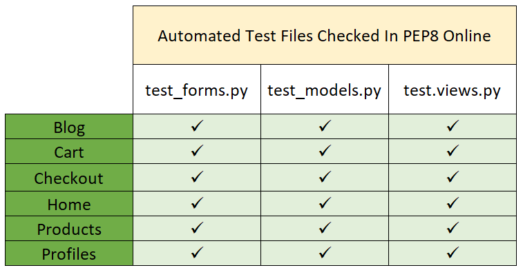

<br>

No errors remain within these files.


<br>

##### back to [top](#table-of-contents)
---

## Performance
[Google Chrome Developer Tools Lighthouse test](https://developers.google.com/web/tools/lighthouse) was used to test the website with regard to Performance, 
Accessibility, Best Practices and Search Engine Optimization. 

<br>

**Lighhouse Mobile Test Results for index.html**


<br>

**Lighhouse Desktop Test Results for index.html**


<br>

Lighthouse suggestions for improving the site's score include eliminating 3rd party 
render-blocking resources from Bootstrap, Google Fonts, Fontawesome and JQuery.
It was deemed beyond the scope of the current project to serve these critical resources inline.


<br>

The remaining Lighthouse results are contained in the following tables:


<br>


<br>

##### back to [top](#table-of-contents)
---

## Responsiveness

The Dargan Health Foods site was designed using the mobile-first approach, but it was tested for responsiveness on multiple screen dimensions 
throughout the development process and after project completion using the [Google Chrome Developer Tools Toggle Device](https://developers.google.com/web/updates/2016/03/device-mode-v2) 
function and [Mozilla Firefox Developer Tools](https://developer.mozilla.org/en-US/docs/Tools).  

### Device Responsiveness

**Mobile Devices Tested**


<br>

**Tablet Devices Tested**


<br>

**Laptop and Desktop Dimensions Tested:**


##### back to [top](#table-of-contents)
---

<br>

### Browser Responsiveness

Each website feature, including accordions, buttons, modals, external links, hover effects etc. was manually checked within the following web browsers:
- Google Chrome
- Microsoft Edge
- Microsoft Opera
- Mozilla Firefox


<br>

#### Functions Tested As A Logged-Out User

**Home Page**

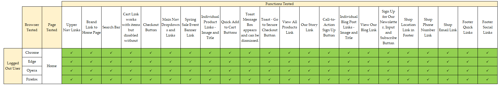

<br>

**Contact Us Page**

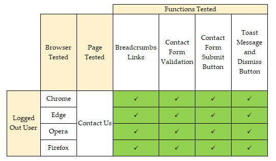

<br>

**Our Story Page**

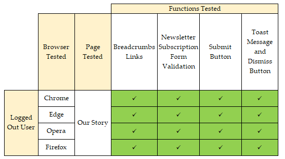

<br>

**Registration Page**


<br>

**Login Page**


<br>

**All Products Page**


<br>

**Product Details Page**


<br>

**Cart Page**

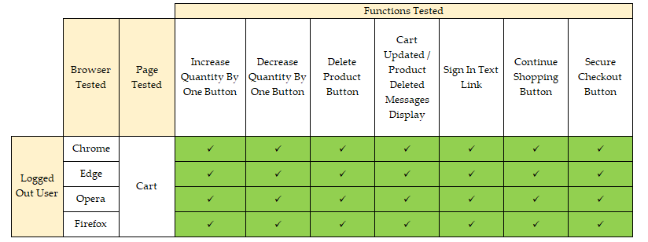

<br>

**Checkout Page**


<br>

**Checkout Success Page**


<br>

**Blog Page**


<br>

**BlogPost Page**


##### back to [top](#table-of-contents)
---

<br>

#### Functions Tested as a Logged-In User

**Home Page**


<br>

**Contact Us Page**


<br>

**Our Story Page**


<br>

**Sign Out Page**


<br>

**My Account Page**


<br>

**All Products Page**


<br>

**Product Details Page**


<br>

**Add Product Review Page**


<br>

**Edit Product Review Page**


<br>

**Cart Page**


<br>

**Checkout Page**


<br>

**Checkout Success Page**


<br>

**Blog Page**

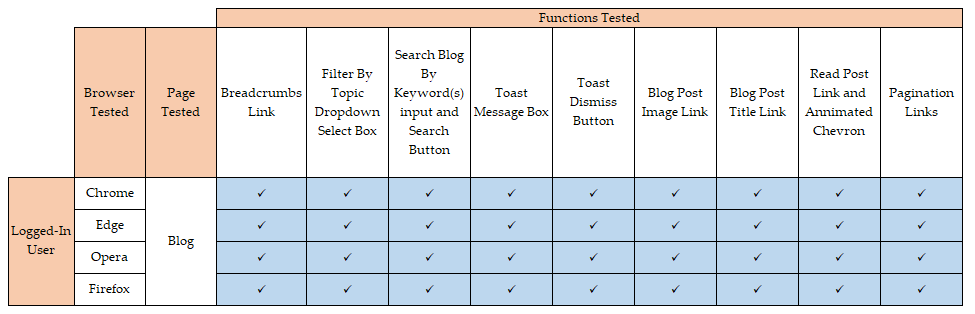

<br>

**BlogPost Page**


<br>

**Add Blog Comment Page**


<br>

**Edit Blog Comment Page**


<br>

##### back to [top](#table-of-contents)
---

## Defensive Design

As a Logged-Out User it was attempted to access a Dargan Health Food member's account and associated pages as well as the SuperUser's Admin, Blog and Product management pages using the following urls:

* A **Profile** page: http://dargan-health-foods.herokuapp.com/profile/

  &#9745; redirects to the Login page.

* A member's **Order History** page: http://dargan-health-foods.herokuapp.com/profile/order_history/D9AC156EA79B4BDD86CA53C3D6DF077C

  &#9745; redirects to the Login page.

* A member's **Add Product Review** page: http://dargan-health-foods.herokuapp.com/products/add_review/11

  &#9745; redirects to the Login page.

* A member's **Edit Product Review** page: http://dargan-health-foods.herokuapp.com/products/edit_review/1

  &#9745; redirects to the Login page.

* A member's **Delete Product Review** link: http://dargan-health-foods.herokuapp.com/products/delete_review/2

  &#9745; redirects to the Login page.

* A member's **Edit BlogComment** page: http://dargan-health-foods.herokuapp.com/blog/edit_comment/11

  &#9745; redirects to the Login page.

* A member's **Delete BlogComment** link: http://dargan-health-foods.herokuapp.com/blog/delete_comment/2

  &#9745; redirects to the Login page.

* A member's **Change Password** page: http://dargan-health-foods.herokuapp.com/accounts/password/change/

  &#9745; redirects to the Login page.

* The site **Admin** page: http://dargan-health-foods.herokuapp.com/admin

  &#9745; redirects to the Administrative Login page.* 
  
* A superuser's **Add Product** page: http://dargan-health-foods.herokuapp.com/products/add/

  &#9745; redirects to the Login page.

* A superuser's **Edit Product** page: http://dargan-health-foods.herokuapp.com/products/edit/13

  &#9745; redirects to the Login page.

* A superuser's **Delete Product** link: http://dargan-health-foods.herokuapp.com/products/delete/12

  &#9745; redirects to the Login page.

* A superuser's **Add Blogpost** page: http://dargan-health-foods.herokuapp.com/blog/add_post/

  &#9745; redirects to the Login page. 

* A superuser's **Edit Blogpost** page: http://dargan-health-foods.herokuapp.com/blog/edit_post/3

  &#9745; redirects to the Login page. 

* A superuser's **Delete Blogpost** link: http://dargan-health-foods.herokuapp.com/blog/delete_post/1

  &#9745; redirects to the Login page. 

<br>


##### back to [top](#table-of-contents)

## Tested User Stories

<br>

#### Tested Prospective User Stories

I am a prospective Dargan Health Foods site member I want to be able to:

&#9745;	Immediately comprehend the purpose behind the Dargan Health Foods site.

Upon opening the homepage the user is presented with the Dargan Health Foods logo and brand heading
which identifies the site as an e-commerce store which sells health food. 


<br>

Beneath the Sale banner the user is presented with images and links to the Latest Products,
showing them a selection of the items on offer in the store.


<br>

Further down the same page the 'About Us' section further clarifies what the store sells.

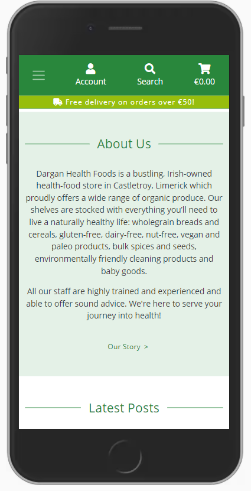

<br>

This 'About Us' section can be reached easily from any page on the site through the links provided
in the top navbar on the desktop, within the toggle dropdown navigation menu on a mobile or from
the 'Quick Links' link provided in the Footer.

Beneath the 'About Us' text is a link which brings the user to the 'Our Story' page
 where they can read about the origins of the business and its ethos.


<br>

&#9745; Identify where the physical store is located.

Within the footer on each page the user is presented with the shop's business address 
which is also a link bringing the user directly to the shop's location on 
[Google Maps](https://www.google.com/maps/place/Dargan+Health+Foods/@52.6663666,-8.5551142,17z/data=!3m1!4b1!4m5!3m4!1s0x485b5c109808a3ed:0x872b2c8c38046fe5!8m2!3d52.6663666!4d-8.5529255).


<br>

This same information is contained within a dropdown-accordion, entitled 'Find Us', on mobile and portrait tablet devices.


<br>


&#9745; Easily see what products are available.

On the Home Page, site visitors, are presented with the four latest products to be added to the site.


<br>

Beneath these products there is a link which takes the user to a page of All New Products added to the site.


<br>

Alternatively, visitors can access site products by choosing one of the departmental titles, and their desired 'Category' choice from those displayed on the main Navbar.


<br>

These options are contained within the dropdown menu, accessed using the Hamburger icon, on mobile devices.


<br>

&#9745; Search for specific products by name or category.

As well as using the aforementioned 'Department' and 'Category' links, users can access specific products 
by entering a brand name, product-title, tag or ingredient into the search bar on the navbar.


<br>

This input box and button appear when the magnifying-glass logo on the mobile navbar is selected.


<br>

&#9745; Sort products by category, price or alphabetically.

Users can sort the site products by category by simply choosing the desired category from the main
navigational menu or by searching for that category using the search bar.


<br>

The products returned can be sorted by rating, alphabetically or by price, regardless of whether the search was 
conducted using the search bar or by selecting one of the main navigation department or category options.


<br>

&#9745; Be presented with an image of the product itself.

When the viewer searches for a product, department, category etc. they are presented with a range
of relevant results which show a small image of the individual products, if an image is available.


<br>

If they viewer chooses to examine a product in more detail they can click on the product image, 
or the product title to be brought to that specific product page.  If more than one image 
exists for that product they are contained within an image carousel.


<br>

&#9745; Be able to read a description of a each product.

A user can read a product description on each product detail page.


<br>

&#9745; Be presented with nutritional information or ingredients where applicable.

On the Product Details pages for each product, if an ingredients list is available, it is to be 
found within the Details Accordion.


<br>

Further information regarding allergens is to be found within the More Information accordion.


<br>

&#9745; Read site members’ product reviews.

Other customers' reviews of individual products can be found within the Customer Reviews accordion
on each Product Detail page.


<br>

The accordion can be accessed directly or by clicking on the Review Count link next to the product's 
star rating.

&#9745; Add products to my shopping cart with ease.

Users can use the 'Add to Cart' buttons on any Product Card to add a single unit of that 
product to their cart, without having to open that product's Details page.


<br>

A specific quantity of any item can be added to a user's cart using the Quantity Form and 'Add to Cart' button on the
product's Details page.  


<br>


&#9745; Be presented with a constant visual reminder of my shopping cart total and number of items already added.

The number of products within a user's cart and the cart total are displayed on the navbar at all times.


<br>

This information is displayed within the mini-cart on the desktop navbar.


<br>

The updated cart information is also communicated to the user using Toast messages. 
With each item added to the cart, a Success Toast appears with images of the products in the cart, their titles, and the
quantity as well as a Cart total.


<br>


&#9745; Be able to edit my shopping cart, increasing or decreasing the quantity of a specific item or deleting it altogether, at will.

When the user opens the Cart page they are presented with a table of the items in their cart.
Each item row has a Quantity form allowing the user to increase or decrease the quantity as needed.
If they decrease the quantity to zero, the item is removed from the cart.
Alternatively, they can delete any item from the cart in one click using the individual trash-can icons
at the end of the product row.
With each adjustment of the cart the user is given feedback, the quantity updates, the line-item subtotal is
updated, as is the Cart Total and Order Total within the Summary table.
Further feedback is provided with textual messages, in green for success or in red for errors, 
which specify which item has been removed etc.


<br>

&#9745; Pay for my items using a secure credit-card payment system.

When a user is ready to pay for their items they can do so on the Checkout page.
An order summary, displaying all the items the user has in their cart, ready to purchase,
is displayed in a helpful summary table.


<br>

Once the Billing Details form and Credit Card input has been filled out the credit card payment is handled securely by [Stripe](www.stripe.com).


<br>

A loading overlay and spinning icon provide visual assurance to the user that a process is taking place.


<br>

&#9745; Receive immediate visual feedback when my payment has been accepted.

Upon successful processing of the payment the user is brought to the Checkout Success page.
This displays the Order details and provides the user with reassurance that their purchase has gone through.
A toast message re-affirms that a Confirmation Email is being sent to the email address provided.


<br>

&#9745; Receive an email confirming my purchase, order details and delivery information.

A Confirmation Email is sent to the email address provided by the customer.
This gives the customer a record of their order number and date of purchase as well as
the price paid and the delivery cost and the address the order will be shipped to. 


<br>

&#9745; Read Dargan Health Foods' blog posts.

The Dargan Health Foods Blog can be accessed from any page using the link in the top navbar on the
desktop, the main dropdown menu on a mobile or from within the Quick Links in the Footer.
Additional links to the latest blog posts are provided on the Home Page.
The BlogPost card images and the BlogPost titles operate as direct links to the featured posts.


<br>

The main blog links bring the user to the Blog page where the user can filter posts by topic or search
the Blog for a post by keyword(s).


<br>

A snippet of the BlogPost introductory paragraphs provides the user with further insight as to 
the contents of each before they make the final decision as to whether they want to read the full post.
For consistency, these BlogPost card images and titles also operate as links to the individual BlogPost
pages.

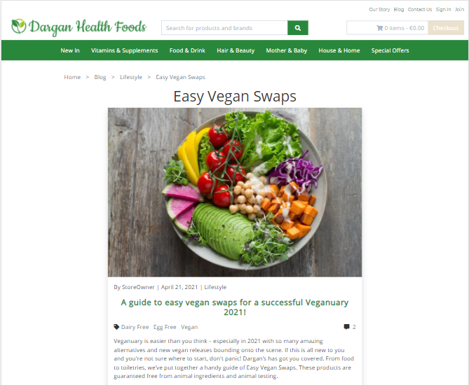

<br>

Breadcrumbs navigation has been provided at the top of each Post to facilitate navigation within the Blog.


<br>

Keywords assigned to the BlogPost have been rendered as Tag links below the subheading. The user can
browse other posts which share the Tag classification by clicking on the tags.

Ease of navigation has been further assisted through the inclusion of the Blog Search Bar
within the Search Blog accordion on each BlogPost page.


<br>

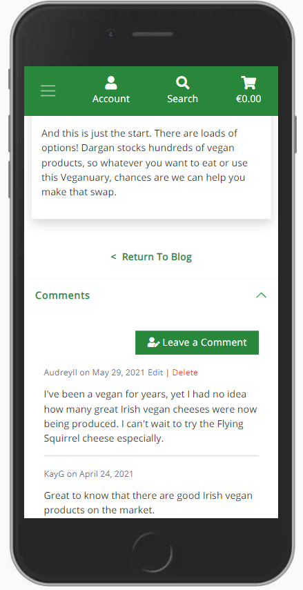

<br>

&#9745; Easily get in contact with the store if I have any questions.

Site visitors can easily contact the Dargan Health Foods team by filling out and submitting the
Contact Us form, links to which are provided on the desktop topnav, the mobile main dropdown 
menu and within the Footer Quick Links.


<br>

Alternatively, the store's address, email address and phone number are to be found within the Footer
'Find Us' section.


<br>
 
Users can see the most appropriate hours to contact the team by phone, or in person, by
looking at the Opening Hours provided in the Footer on every page.


<br>

&#9745; Easily locate any social media accounts connected to the site.

Social links are located in the Footer providing the user with direct access to
the company's Facebook and Instagram account pages.


When these links are clicked a new tab opens and the relevant page is displayed without closing the Dargan Health Foods site itself.
<br>

&#9745; Navigate through the site with ease.

A simple design structure with a fixed navbar with dropdown menus, accessible from every page of the site, provides
easy access to any page within the website. A brand logo, displayed in the top left of the screen on a desktop device,
operates as a direct link to the homepage.


<br>

The site Footer is divided into three separate sections, which are rendered neatly as collapsed accordions on mobile devices. 
The first section/accordion provides links to the homepage, in the form of the brand header, a link to the home page,
and links to facilitate ease of contact by email or by phone. 
There is also a helpful link, which opens an external tab, showing the shop's physical location on Google Maps.

Within the third section/accordion, links to commonly required site pages are 
rendered for convenience.  This provides the user with easy navigation across the site 
both at the top and bottom of the page.


<br>

Breadcrumbs navigation links, within the products pages and the blog pages, 
operate as a kind of secondary navigation scheme, revealing the user's location within 
that section of the website and also allowing them to jump directly to related pages along the 
path.


<br>

&#9745; Easily find information outlining the features that membership of the site offers to its registered users.

A section of the Home Page is devoted to encouraging new users to become a site member.
This 'Members Get More' section outlines some benefits such as membership discounts and access
to exclusive events. A call-to-action button brings to the user straight to the registration page
where they can sign up and use their new member discount code immediately to get 10% off their order.


<br>

This information is reiterated on the registration page itself.


<br>

Within the Shopping Cart page, non-logged-in user's are provided with a link to the Sign In page
so that they can apply their Promo Code and receive their discount.  This operates as a reminder to
non-registered users as to the financial benefits of becoming a Dargan's member.


<br>

On the Checkout Page, the Dargan members' smoother checkout experience is emphasised. 
Non-site members are encouraged to Sign In or to Sign Up so that they too can avoid
the time-consuming form-filling process on subsequent visits.


<br>


&#9745; Easily register to become a site member.

Site visitors are presented with numerous opportunities to become site members.
On the desktop top navbar, the 'Join' link is always visible.  It brings the user directly to
the 'Sign Up' page. The 'Register' link can be found on mobile devices when the 'Account' user icon is clicked.


<br>

Users can also access the registration page using the call-to-action button in the
'Members Get More' section of the Home Page.


<br>

Another 'Sign Up' link is to be found within the 'Quick Links' section/accordion in the Footer on each page.


<br>

Each of these registration links brings the user to the 'Sign Up' page where they can easily 
become site members by filling in the clearly labelled form and pressing the eye-catching 'Sign Up' button.


<br>

Successful submission of the form brings the user to the next stage in the registration process, email verification.
They are brought to page where they are informed that an email verification link has been sent to the address they provided.

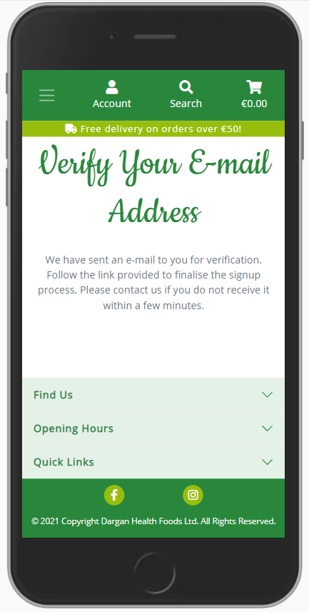

<br>

Clicking the link sent in that email brings the user back to site to the following page
where they can confirm the address connected to their account and finish the registration process.


<br>

The user is then redirected to the 'Login' page with a Success Toast message.


<br>

##### back to [top](#table-of-contents)
---

#### Tested Existing User Stories

I am an existing Dargan Health Foods site member I want to be able to:

&#9745; Log in to the site.

Links to the 'Login' page are provided at numerous points throughout the site, however, 
they are most clearly visible on the topnav on a desktop device or within the
'Account' dropdown on a mobile device or within the 'Quick Links' section of the footer.


<br>


<br>


<br>

All of these links bring the user directly to the 'Login' page.  Here the user is presented
with a clearly labelled form.  They can log into the site
by entering their username or email address and their password and pressing the 'Sign In' button.


<br>

&#9745; Navigate through the site with ease.

For the logged-in user, site navigation is 

&#9745; Log out of the site.

Users can log out of the site using the 'Logout' links provided in the site navbar and footer.


<br>


<br>

These links bring the user to the 'Sign Out' page, where they can complete the process by pressing the 
'Sign Out' button.


<br>

A toast message is used to comfirm that the user has been logged out.


<br>

&#9745; Edit my account information.

Site members have access to their Profile/My Account page through the links provided in the navbar and in the footer
'Quick Links' section.


<br>

These links brings the site member to their personal Account page where they have access
to their Account Details, Address Book, Order History, Product Reviews and Blog Comments.


<br>

On this page, within the first tabbed navigational pane, the user can choose to change their password.


<br>

The second tabbed navigational pane offers the user the chance to edit their default delivery address
and telephone number.


<br>


&#9745; Take advantage of my site membership by applying discount codes.


<br>


<br>

&#9745; Purchase my desired products using a secure online payment system.

&#9745; Receive an order confirmation email.

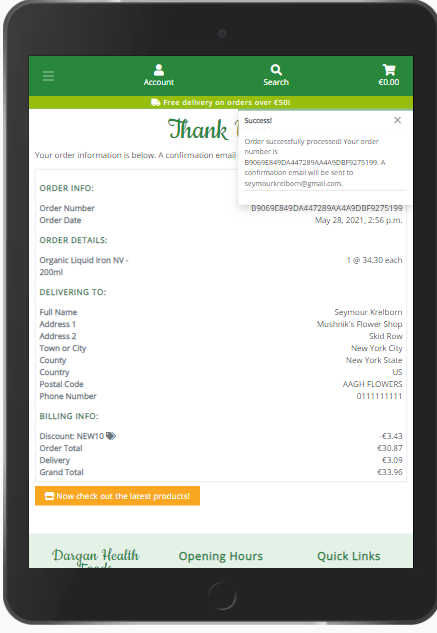

<br>

&#9745; View my order history.


<br>


&#9745; Search for a product by entering a brand name or product name into a search box within the site.

&#9745; Search for a product by department, e.g. Hair & Beauty, Vitamins & Supplements, Special Offers.

&#9745; Sort search results, by price, alphabetically or by rating.

&#9745; Filter search results by allergen or other pertinent tags.

&#9745; See images of the product packaging.

&#9745; Read detailed descriptions of products.

&#9745; Read reviews of products written by site members.
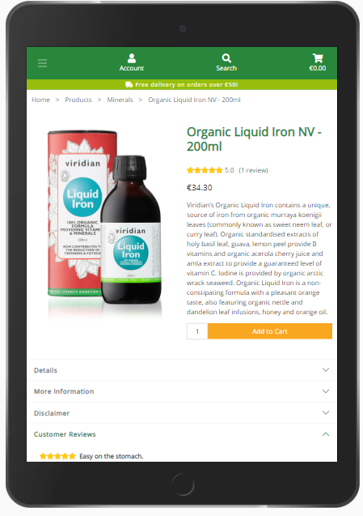

<br>

&#9745; Leave a review of a product that I have previously purchased through the site.


<br>


<br>


&#9745; Input my review easily into a user-friendly form that is straightforward to use.


<br>


<br>


<br>


<br>

&#9745; Edit or delete my own reviews.


<br>


<br>


<br>


&#9745; Be secure in the knowledge that no other user can edit or delete my reviews.


<br>


&#9745; Be secure in the knowledge that measures have been put in place to prevent me from accidentally deleting one of my own reviews.


<br>

&#9745; Contact the store owner.

Site members can easily contact the Dargan Health Foods team by filling out and submitting the
Contact Us form.  Links to this page are provided on the desktop topnav, the mobile main dropdown 
menu and within the Footer Quick Links.


<br>

The Dargan Health Foods shop address, business email address and phone number are to be found within the Footer
'Find Us' section/accordion in the footer on each page.


<br>
 
Site members are provided with the shop's Opening Hours within the section/accordion of the same
name in the footer.


<br>

&#9745; Easily locate any social media accounts connected to the site.

Links to the Dargan Health Foods Facebook and Instagram accounts are to be found in the footer on every page.


<br>

&#9745; Navigate with ease to the site's blog.

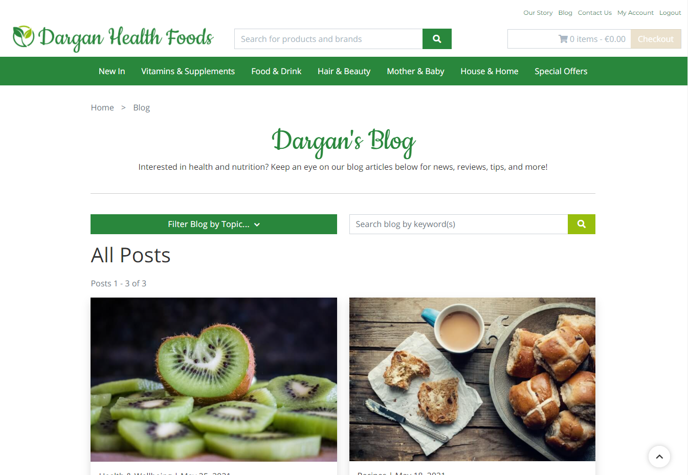

<br>

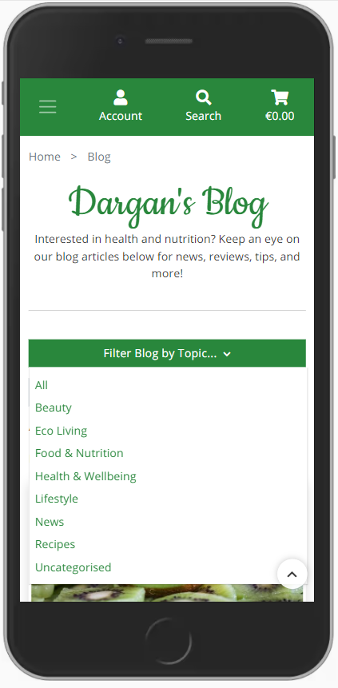

<br>


<br>

&#9745; Search for a blog post by title or keyword.


<br>

Ease of navigation has been further assisted through the inclusion of the Blog Search Bar
within the Search Blog accordion on each BlogPost page.


<br>


&#9745; Comment on a blog post.

Beneath each blog post, within the 'Comments' accordion, there is a 'Leave a Comment' button.

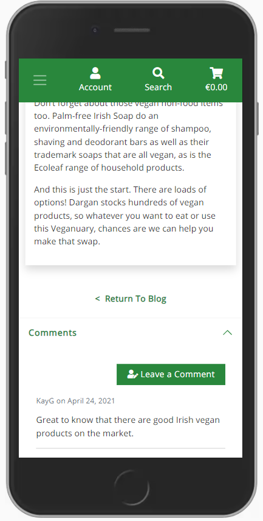

<br>

This brings users to the Blog Comment form, which allows them to simply input their comment
into a text field and 'Upload' it.

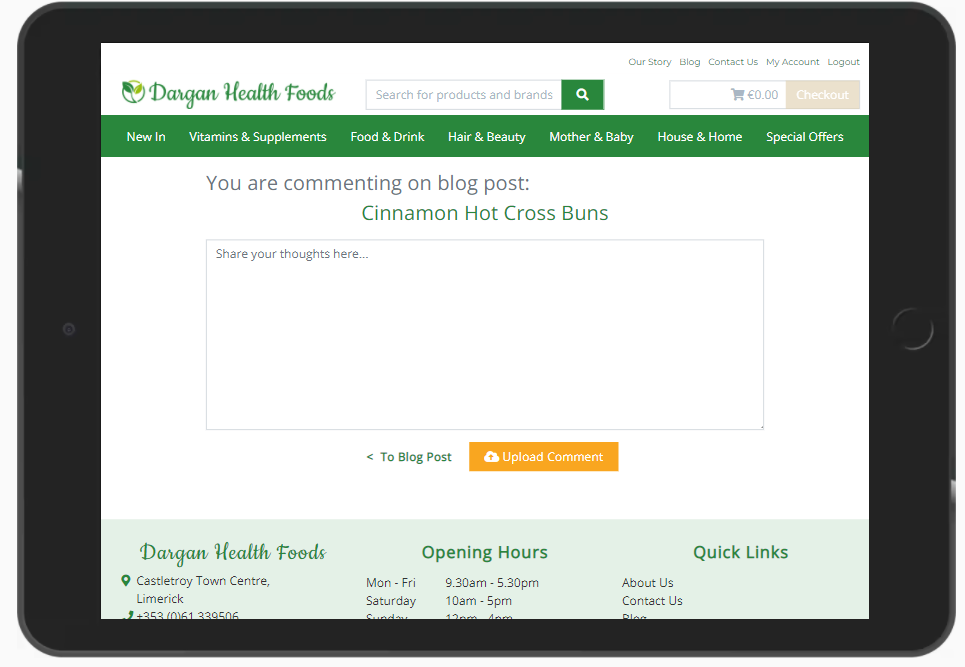

<br>

When the user uploads their comment successfuly they are given feedback in the form of a 
Success Toast message.


<br>

&#9745; Edit or delete my own comments.

Each site member has the ability to Edit or Delete their own Blog Comments.

Edit and Delete links are to be found next to the individual comments beneath the BlogPost.
These are visible solely to the creator of the comment in question.


<br>

Alternatively members can access all of their Blog Comments and the associated Edit and Delete links
from within their My Account page.


<br>

The Edit link brings the user to the Edit Comment form where they can change their comment.

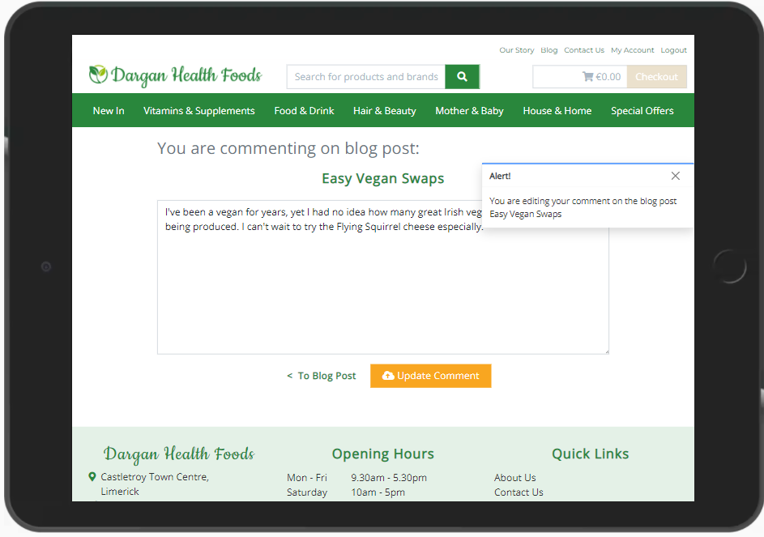

<br>

The Delete link opens a Delete Modal asking the user to confirm their decision to delete their
comment.  If they choose to continue with the action by pressing the Delete button, 
the comment is deleted from the database.


<br>


##### back to [top](#table-of-contents)
---

#### Tested Site Owner Stories

##### back to [top](#table-of-contents)
---

## Manual Testing

##### back to [top](#table-of-contents)
---

## Automated testing

### Unittests

Django's testing framework was used to create automated tests for the project.

A tests directory was added to each app.
Within these directories individual files were created to test the app's views, models and forms.

In order to run specific tests, the following command can be used:
```
python3 manage.py test <app_name>.tests.<test_name>
```

To run all the tests use the command:
```
python3 manage.py test
```

[Coverage](https://coverage.readthedocs.io/en/coverage-5.5/)
was used to identify the percentage of code covered by the tests.

<br>

##### back to [top](#table-of-contents)
---

### Coverage Installation and Setup

Install the package using pip.
```
pip3 install coverage
```

Add this new dependency to your requirements.txt file.
```
pip3 freeze > requirements.txt
```

Run all the tests within in a specific app using the following command:
```
coverage run --source=<'app_name'> manage.py test
```

To generate a report of the results in the terminal use:
```
coverage report
```

Alternatively, a directory containing HTML versions of the report sections 
can be created by typing:
```
coverage html
```
The report can then be viewed in a web browser using the command:
```
python3 -m http.server
```
and selecting the 'htmlcov/' directory.

<br>

##### back to [top](#table-of-contents)
---

### Automated Test Links and Coverage Results

|Test Files                                         |   Tests                                                   | Coverage Result |
|---------------------------------------------------|-----------------------------------------------------------|----------|
|[Blog Forms](blog/tests/test_forms.py)             |   BlogPostForm and BlogPostCommentForm validation.        |100%|
|[Blog Models](blog/tests/test_models.py)           |   Topic, BlogPost, BlogPostTag and BlogPostComment Model creation and string methods. That BlogPost titles are slugified.|98%|
|[Blog Views](blog/tests/test_views.py)             |   All blog posts and individual blogpost views.           |28%|
|[Cart Forms](cart/tests/test_forms.py)             |   DiscountCodeForm creation.                              |100%|
|[Cart Models](cart/tests/test_models.py)           |   DiscountCode Model creation and string method.          |100%|
|[Cart Views](cart/tests/test_views.py)             |   Calculating cart subtotal, testing the cart view, add to cart functionality, and adjusting and removing items from the cart |21%|
|[Checkout Forms](checkout/tests/test_forms.py)     |   OrderForm creation and required fields                  |100%|
|[Checkout Models](checkout/tests/test_models.py)   |   Order and OrderLineItem model creation and string methods. Also test the OrderLineItem get_total_lineitem_price method.|94%|
|[Checkout Views](checkout/tests/test_views.py)     |   Testing checkout and checkout success view              |27%|
|[Home Forms](home/tests/test_forms.py)             |   NewsletterSubscription and Contact form validation and required fields.|100%|
|[Home Models](home/tests/test_models.py)           |   NewsletterSubscription model creation and string method.|100%|
|[Home Views](home/tests/test_views.py)             |   Testing index, our_story and  contact views.            |46%|
|[Products Forms](products/tests/test_forms.py)     |   ProductForm and ProductReviewForm creation and validation.|100%|
|[Products Models](products/tests/test_models.py)   |   Brand, Department, Category, Tag, Product, ProductImage, ProductTag and ProductReview model creation and string methods.|100%|
|[Products Views](products/tests/test_views.py)     |   Testing form fields, products, product detail, add product and edit product view, adding a product, and sort and filter functionality|25%|
|[Profiles Forms](profiles/tests/test_forms.py)     |   DargansCustomSignupForm and UserProfileForm creation and validation. |81%|
|[Profiles Models](profiles/tests/test_models.py)   |   UserProfile and DiscountCode2User model creation and string methods.|100%|
|[Profiles Views](profiles/tests/test_views.py)     |   Profile view when a user is logged in, and not logged in. If successful, check that the correct template was rendered. |68%|

<br>

##### back to [top](#table-of-contents)
---

### Overall Automated Test Coverage

|App Name           |Percentage of App Code covered by Tests     |
|:-------------------|:-------------------:|
|Blog               |67%                |
|Cart               |55%                |
|Checkout           |58%                |
|Home               |81%                |
|Products           |70%                |
|Profiles           |89%                |

<br>

##### back to [top](#table-of-contents)
---

## Bugs

### Pagination Issue
[Pagination]((https://github.com/nualagr/dargan-health-foods/commit/7b8b1e0fc9afd4d0f8b39b69611bc38c8679ff28)) was applied to the products.html page and initially worked correctly.  However, once filtering of products 
by search criteria was implemented, the pagination 'previous' and 'next' buttons
brought the user to page one or three of the products.html page, rather than the page associated with the chosen queryset. 
This problem was put to one side. Filtering of products by category and department was implemented. Then sorting of 
results was developed. Once filtering by tag had been put in place the issue of pagination was again approached.
At first 
```
{{ request.get_full_path }}
```
was used to get the url and feed it to the 'next' and 'previous' pagination buttons, however this was unsuccessful since this 
url contains not only the search criteria etc., but also '?page=1'. Therefore, when navigating from 'page=2' to 'page=1', 
the former remained within the url, invalidating it. 

The application of a [custom template tag](https://github.com/nualagr/dargan-health-foods/commit/dd1d2fddb32e018da0371fd252210762fe3eb062)
succeeded in rectifying the issue.  In the template the custom template tag 'current_query_url' 
is called and it is passed three arguments, the 'page' keyword, the current page number and the current url.
```
href="" aria-label="Link to Previous Page">
```
Within the template tag the new page-number element of the url is reconstructed from the 'page' 
keyword and the new page_number value. Then the encoded url is split into its constituent parts at the '&'.
The page-number element is filtered out and the remaining query element(s) are reattached using an ampersand.
Finally the query elements of the url are connected with the new page number element and returned to the template.

``` {.python3}
@register.simple_tag
def current_query_url(key, value, urlencode=None):
    # Isolate the page number in the format ?page=1
    url = "?{}={}".format(key, value)
    if urlencode:
        queries = urlencode.split("&")
        # Isolate queries from page number
        filtered_queries = filter(lambda q: q.split("=")[0] != key, queries)
        # Join queries using the ampersand
        encoded_queries = "&".join(filtered_queries)
        # Reattach the queries to the page number
        url = "{}&{}".format(url, encoded_queries)
    return url

```

This succeeded in bringing the user to the next/previous page of the results queryset, including 
the chosen category, department, tag or search term and sorting choice.

Pagination caused issues [again](https://github.com/nualagr/dargan-health-foods/commit/80532381676ebbe2f619fbffd42b5d5f0add8c97) 
once the site had been populated with a significant number of products as
the number of page links resulted in horizontal overflow, particularly when viewed on mobile devices.
An answer posted on [StackOverflow](https://stackoverflow.com/questions/41131802/django-paginator-page-range-for-not-displaying-all-numbers)
suggested limiting the number of links being rendered within the template.
An 'if' 'elif' 'else' block was added to the pagination.html include to limit the number 
of page numbers being rendered to +-3 on either side of the active page number.
```
 
    
        <li class="page-item active">
            <span class="page-link">{{ i }}
                <span class="sr-only">(current)</span>
            </span>
        </li>
    
        <li class="page-item">
            <a class="page-link" href="" aria-label="Link to Page {{ i }}">{{ i }}</a>
        </li>
    
    

```
This removed the horizontal overflow, but is not an ideal solution as it was not immediately obvious
to the viewer that the page range does not reflect the total number of pages returned.

<br>

### Multiple Destination Redirects
This issue arose in relation to two different pages, the Edit Product Review 
page and the Edit BlogPost page.  Links to these pages exist in multiple locations within the site.
Initially the redirects, upon submission of the forms, were hardcoded to a single location. 
If the user edited their product review they were redirected to the product page, 
even if they had clicked the 'Edit' button on their Profile page.
This was less than satisfactory, from a user-experience point of view.
[In order to redirect users to the page from which they had initially come](https://github.com/nualagr/dargan-health-foods/commit/0ee02100805b0a999e9a9fac397cd26c41b13bf3),
it was necessary to capture the referring page url from the HttpRequest.META, 
which is a dictionary containing all the HTTP headers including the HTTP_REFERER. 
As this value changes to the current url upon the submission of the form
it was necessary to assign the referring url, with the GET request, to a hidden input on the EditReview form.
```
<input type="hidden" value="{{ request.META.HTTP_REFERER }}" name="previous_page_url">
```
The referring url is now posted along with the review to the edit_review view where an 'if' 'else'
block checks for the existence of the substring "profile" within the url before redirecting to the 
appropriate page.
``` {.python3}
# If the user got to the edit review page from their profile
# Redirect them back to their profile page.
if "profile" in previous_page_url:
    return redirect(reverse("profile"))
else:
    # Redirect to the Product's Details Page
    return redirect(reverse("product_detail", args=[product.id]))
```

<br>

### Product Discount Price Issue
When it came to applying a [discount to individual products](https://github.com/nualagr/dargan-health-foods/commit/506f2f19c369db6eba3a474022047e26b5cc1ae2),
for the purposes of an MVP, a 'discount_price' field and a Boolean 'on_offer' field were added to the Product model. 
This allowed SuperUsers to mark individual product prices down from within the admin panel. 
This new structure was then reflected in the OrderLineItem Model where the subtotal for each lineitem is calculated. 
An issue arose relating to a User's past orders however.  The Order model accesses the 'product.price' through a Foreign Key to the Product model.
This points to the price for that product, as it appears, currently, in the database. 
The Order, however, needed to reference the price, as it existed, when the order was originally placed.
This original price had been, and still is, stored in the Order model within the json string of the original_cart.
To facilitate easier access to this vital piece of information, a new field, 'product_price_paid', was added to the OrderLineItem model.
This value is now set when the OrderLineItem is saved. 
It is this field that is now accessed and displayed within each order on the profile.html 'My Orders' tab.

<br>

### Discount Code Issues
The addition of Discount Codes to the project required revision of many elements of the payment process.

At first, a very simple [DiscountCode model](https://github.com/nualagr/dargan-health-foods/commit/c9445ca3d1c48bb004ce65434aaf856e3cfdcad2) 
of only two fields was used. This consisted of the promo code and the associate percentage discount to be applied.
After reading Kim Salazar's article ["Applying Discounts and Ecommerce Websites"](https://www.nngroup.com/articles/applying-discounts/) it became clear
that, from a user-experience point-of-view, it would be best to allow site users to apply this code within the Cart rather than making them wait
until they were on the Checkout page. This approach enables people to check that the discount code is valid before they enter any personal information 
and also allows the total to be updated appropriately early in the process.
A DiscountCodeForm, based on the DiscountCode model was created and rendered on the cart.html page. On submission of this form, the discount code, 
if valid, is stored in the Session Cookie.

The discount_amount is then calculated and applied to the cart 'total' within the cart_contents context.
The discount code object is saved in a variable, discount_code, and added to the context dictionary so that it is globally available within the different templates.

Within the 'checkout' view the discount code object ID is obtained from the session cookie.
The corresponding DiscountCode object is attached, as a ForeignKey field, to the Order before it is saved to the database.
Then when .save() is called on the Order, the update_total() method is called and the discount applied.

To be able to provide the user with visible feedback on the financial benefit of the addition of their promo code, 
a new variable, ['total_before_discount'](https://github.com/nualagr/dargan-health-foods/commit/cdac94bafada5d89e5310a452a4785b2cbb578fe)
was created within the cart_contents context.  'If' 'else' statements were added to the checkout_success.html page to render the discount code and the amount
of money discounted, providing the user with confirmation that they received their discount.  

Within the '_send_confirmation_email()' function in the webhook_handler two new variables were created to store the discount code and amount discounted.
These are set to empty strings if no discount code was used. Otherwise, the discount code and amount discounted are printed within the email providing
customers with a confirmation that their promo code had been applied and that they had received the discount they expected.

Logic then had to be applied to [handle the discount when orders are created within the webhook](https://github.com/nualagr/dargan-health-foods/commit/fabfac039b94966cbd99fc3b59e166e2c4d5bd44). 
This process is triggered when errors occur during the checkout process, such as the browser being closed before the Order has been created in the database.
In the cache_checkout_data() function in the checkout/views.py a json string of the discount code was attached to the Payment Intent metadata. 
Within the handle_payment_intent_succeeded() function this is unpacked and the associated DiscountCode object located in the database. 
This object can then be linked to the discount_code ForeignKey field on the newly created Order.
This ensured that Orders created in this manner, within the webhook, now correctly reflect the discount applied by the user in the Cart.

An issue arose in relation to this however as [exceptions were raised when no discount code had been applied to the Order being created in the webhook](https://github.com/nualagr/dargan-health-foods/commit/0b92b6e7594f0881dc2f2cb0d934ddf8b95511e7).
Different solutions, suggested by [StackOverflow](https://stackoverflow.com/questions/3090302/how-do-i-get-the-object-if-it-exists-or-none-if-it-does-not-exist) members were attempted.
In the end an 'if' 'else' statement was inserted before the 'try' 'except' block in which the Order is created.
This retrieves the DiscountCode object from the database, if one exists, and if not, it sets the variable to 'None'. 
Now Orders, with or without discount codes, are successfully created within the Webhook Handler in the event of errors during the checkout process.

##### back to [top](#table-of-contents)
---

## Unresolved Issues


##### back to [top](#table-of-contents)
---
