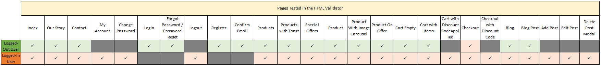

# *Dargan Health Foods* - Testing

## **Table of Contents**

- [Code Validation](#code-validation)
    - [HTML](#html)
    - [CSS](#css)
    - [JavaScript](#javascript)
    - [Python](#python)
- [Performance](#performance)
- [Responsiveness](#responsiveness)
- [Defensive Design Testing](#defensive-design-testing)
- [Tested User Stories](#tested-user-stories)
    - [Prospective User](#tested-prospective-user-stories)
    - [Existing User](#tested-existing-user-stories)
    - [Site Owner](#tested-site-owner-stories)
- [Manual Testing](#manual-testing)
- [Automated Testing](#automated-testing)
    - [Unittests](#unittests)
    - [Coverage Installation and Setup](#coverage-installation-and-setup)
    - [Automated Test Links and Coverage Results](#automated-test-links-and-coverage-results)
- [Bugs](#bugs)
    - [Pagination Issue](#pagination-issue)
    - [Multiple Destination Redirects](#multiple-destination-redirects)
    - [Product Discount-Price Issue](#product-discount-price-issue)
    - [Discount Code Issues](#discount-code-issues)
- [Unresolved Issues](#unresolved-issues)

---

## Code Validation

### **HTML**
[W3C HTML Validation Service](https://validator.w3.org/) was used to validate the HTML code. 

Each page was validated by URI or Direct Input.


<br>

The following table shows the pages that were checked.
No errors or warnings remain.

<br>



<br>

### **CSS**

[W3C Jigsaw CSS Validator](https://jigsaw.w3.org/css-validator/) was used to validate the CSS file.  

<br>

### **JavaScript**
[JSHint](https://jshint.com/) was used to validate the JavaScript used within the site.

<br>

### **Python**
[pep8online.com](http://pep8online.com/) was used to check whether the app.py Python file was PEP8 compliant.

<br>

[infoheap](https://infoheap.com/python-lint-online/) 

<br>


##### back to [top](#table-of-contents)
---

## Performance
[Google Chrome Developer Tools Lighthouse test](https://developers.google.com/web/tools/lighthouse) was used to test the website with regard to Performance, 
Accessibility, Best Practices and Search Engine Optimization. 

<br>

##### back to [top](#table-of-contents)
---

## Responsiveness

The Dargan Health Foods site was designed using the mobile-first approach, but it was tested for responsiveness on multiple screen dimensions 
throughout the development process and after project completion using the [Google Chrome Developer Tools Toggle Device](https://developers.google.com/web/updates/2016/03/device-mode-v2) 
function and [Mozilla Firefox Developer Tools](https://developer.mozilla.org/en-US/docs/Tools).  

**Mobile Devices Tested**
<br>

**Tablet Devices Tested**

<br>

**Laptop and Desktop Dimensions Tested:**
<br>

Each website feature, including buttons, modals, external links, hover effects etc. was manually checked within the following web browsers:
- Google Chrome
- Microsoft Edge
- Microsoft Opera
- Mozilla Firefox


<br>


##### back to [top](#table-of-contents)
---
## Defensive Design Testing

<br>

##### back to [top](#table-of-contents)
---

## Tested User Stories

<br>

#### Tested Prospective User Stories

##### back to [top](#table-of-contents)
---

#### Tested Existing User Stories

##### back to [top](#table-of-contents)
---

#### Tested Site Owner Stories

##### back to [top](#table-of-contents)
---

## Manual Testing

##### back to [top](#table-of-contents)
---

## Automated testing

### Unittests

Django's testing framework was used to create automated tests for the project.

A tests directory was added to each app.
Within these directories individual files were created to test the app's views, models and forms.

In order to run specific tests, the following command can be used:
```
python3 manage.py test <app_name>.tests.<test_name>
```

To run all the tests use the command:
```
python3 manage.py test
```

[Coverage](https://coverage.readthedocs.io/en/coverage-5.5/)
was used to identify the percentage of code covered by the tests.

<br>

##### back to [top](#table-of-contents)
---

### Coverage Installation and Setup

Install the package using pip.
```
pip3 install coverage
```

Add this new dependency to your requirements.txt file.
```
pip3 freeze > requirements.txt
```

Run all the tests within in a specific app using the following command:
```
coverage run --source=<'app_name'> manage.py test
```

To generate a report of the results in the terminal use:
```
coverage report
```

Alternatively, a directory containing HTML versions of the report sections 
can be created by typing:
```
coverage html
```
The report can then be viewed in a web browser using the command:
```
python3 -m http.server
```
and selecting the 'htmlcov/' directory.

<br>

##### back to [top](#table-of-contents)
---

### Automated Test Links and Coverage Results

|Test Files                                         |   Tests                                                   | Coverage Result |
|---------------------------------------------------|-----------------------------------------------------------|----------|
|[Blog Forms](blog/tests/test_forms.py)             |   BlogPostForm and BlogPostCommentForm validation.        |100%|
|[Blog Models](blog/tests/test_models.py)           |   Topic, BlogPost, BlogPostTag and BlogPostComment Model creation and string methods. That BlogPost titles are slugified.|98%|
|[Blog Views](blog/tests/test_views.py)             |   All blog posts and individual blogpost views.           |28%|
|[Cart Forms](cart/tests/test_forms.py)             |   DiscountCodeForm creation.                              |100%|
|[Cart Models](cart/tests/test_models.py)           |   DiscountCode Model creation and string method.          |100%|
|[Cart Views](cart/tests/test_views.py)             |   Calculating cart subtotal, testing the cart view, add to cart functionality, and adjusting and removing items from the cart |21%|
|[Checkout Forms](checkout/tests/test_forms.py)     |   OrderForm creation and required fields                  |100%|
|[Checkout Models](checkout/tests/test_models.py)   |   Order and OrderLineItem model creation and string methods. Also test the OrderLineItem get_total_lineitem_price method.|94%|
|[Checkout Views](checkout/tests/test_views.py)     |   Testing checkout and checkout success view              |27%|
|[Home Forms](home/tests/test_forms.py)             |   NewsletterSubscription and Contact form validation and required fields.|100%|
|[Home Models](home/tests/test_models.py)           |   NewsletterSubscription model creation and string method.|100%|
|[Home Views](home/tests/test_views.py)             |   Testing index, our_story and  contact views.            |46%|
|[Products Forms](products/tests/test_forms.py)     |   ProductForm and ProductReviewForm creation and validation.|100%|
|[Products Models](products/tests/test_models.py)   |   Brand, Department, Category, Tag, Product, ProductImage, ProductTag and ProductReview model creation and string methods.|100%|
|[Products Views](products/tests/test_views.py)     |   Testing form fields, products, product detail, add product and edit product view, adding a product, and sort and filter functionality|25%|
|[Profiles Forms](profiles/tests/test_forms.py)     |   DargansCustomSignupForm and UserProfileForm creation and validation. |81%|
|[Profiles Models](profiles/tests/test_models.py)   |   UserProfile and DiscountCode2User model creation and string methods.|100%|
|[Profiles Views](profiles/tests/test_views.py)     |   Profile view when a user is logged in, and not logged in. If successful, check that the correct template was rendered. |68%|

<br>

##### back to [top](#table-of-contents)
---

### Overall Automated Test Coverage

|App Name           |Percentage of App Code covered by Tests     |
|:-------------------|:-------------------:|
|Blog               |67%                |
|Cart               |55%                |
|Checkout           |58%                |
|Home               |81%                |
|Products           |70%                |
|Profiles           |89%                |

<br>

##### back to [top](#table-of-contents)
---

## Bugs

### Pagination Issue
[Pagination]((https://github.com/nualagr/dargan-health-foods/commit/7b8b1e0fc9afd4d0f8b39b69611bc38c8679ff28)) was applied to the products.html page and initially worked correctly.  However, once filtering of products 
by search criteria was implemented, the pagination 'previous' and 'next' buttons
brought the user to page one or three of the products.html page, rather than the page associated with the chosen queryset. 
This problem was put to one side. Filtering of products by category and department was implemented. Then sorting of 
results was developed. Once filtering by tag had been put in place the issue of pagination was again approached.
At first 
```
{{ request.get_full_path }}
```
was used to get the url and feed it to the 'next' and 'previous' pagination buttons, however this was unsuccessful since this 
url contains not only the search criteria etc., but also '?page=1'. Therefore, when navigating from 'page=2' to 'page=1', 
the former remained within the url, invalidating it. 

The application of a [custom template tag](https://github.com/nualagr/dargan-health-foods/commit/dd1d2fddb32e018da0371fd252210762fe3eb062)
succeeded in rectifying the issue.  In the template the custom template tag 'current_query_url' 
is called and it is passed three arguments, the 'page' keyword, the current page number and the current url.
```
href="" aria-label="Link to Previous Page">
```
Within the template tag the new page-number element of the url is reconstructed from the 'page' 
keyword and the new page_number value. Then the encoded url is split into its constituent parts at the '&'.
The page-number element is filtered out and the remaining query element(s) are reattached using an ampersand.
Finally the query elements of the url are connected with the new page number element and returned to the template.

``` {.python3}
@register.simple_tag
def current_query_url(key, value, urlencode=None):
    # Isolate the page number in the format ?page=1
    url = "?{}={}".format(key, value)
    if urlencode:
        queries = urlencode.split("&")
        # Isolate queries from page number
        filtered_queries = filter(lambda q: q.split("=")[0] != key, queries)
        # Join queries using the ampersand
        encoded_queries = "&".join(filtered_queries)
        # Reattach the queries to the page number
        url = "{}&{}".format(url, encoded_queries)
    return url

```

This succeeded in bringing the user to the next/previous page of the results queryset, including 
the chosen category, department, tag or search term and sorting choice.

Pagination caused issues [again](https://github.com/nualagr/dargan-health-foods/commit/80532381676ebbe2f619fbffd42b5d5f0add8c97) 
once the site had been populated with a significant number of products as
the number of page links resulted in horizontal overflow, particularly when viewed on mobile devices.
An answer posted on [StackOverflow](https://stackoverflow.com/questions/41131802/django-paginator-page-range-for-not-displaying-all-numbers)
suggested limiting the number of links being rendered within the template.
An 'if' 'elif' 'else' block was added to the pagination.html include to limit the number 
of page numbers being rendered to +-3 on either side of the active page number.
```
 
    
        <li class="page-item active">
            <span class="page-link">{{ i }}
                <span class="sr-only">(current)</span>
            </span>
        </li>
    
        <li class="page-item">
            <a class="page-link" href="" aria-label="Link to Page {{ i }}">{{ i }}</a>
        </li>
    
    

```
This removed the horizontal overflow, but is not an ideal solution as it was not immediately obvious
to the viewer that the page range does not reflect the total number of pages returned.

<br>

### Multiple Destination Redirects
This issue arose in relation to two different pages, the Edit Product Review 
page and the Edit BlogPost page.  Links to these pages exist in multiple locations within the site.
Initially the redirects, upon submission of the forms, were hardcoded to a single location. 
If the user edited their product review they were redirected to the product page, 
even if they had clicked the 'Edit' button on their Profile page.
This was less than satisfactory, from a user-experience point of view.
[In order to redirect users to the page from which they had initially come](https://github.com/nualagr/dargan-health-foods/commit/0ee02100805b0a999e9a9fac397cd26c41b13bf3),
it was necessary to capture the referring page url from the HttpRequest.META, 
which is a dictionary containing all the HTTP headers including the HTTP_REFERER. 
As this value changes to the current url upon the submission of the form
it was necessary to assign the referring url, with the GET request, to a hidden input on the EditReview form.
```
<input type="hidden" value="{{ request.META.HTTP_REFERER }}" name="previous_page_url">
```
The referring url is now posted along with the review to the edit_review view where an 'if' 'else'
block checks for the existence of the substring "profile" within the url before redirecting to the 
appropriate page.
``` {.python3}
# If the user got to the edit review page from their profile
# Redirect them back to their profile page.
if "profile" in previous_page_url:
    return redirect(reverse("profile"))
else:
    # Redirect to the Product's Details Page
    return redirect(reverse("product_detail", args=[product.id]))
```

<br>

### Product Discount Price Issue
When it came to applying a [discount to individual products](https://github.com/nualagr/dargan-health-foods/commit/506f2f19c369db6eba3a474022047e26b5cc1ae2),
for the purposes of an MVP, a 'discount_price' field and a Boolean 'on_offer' field were added to the Product model. 
This allowed SuperUsers to mark individual product prices down from within the admin panel. 
This new structure was then reflected in the OrderLineItem Model where the subtotal for each lineitem is calculated. 
An issue arose relating to a User's past orders however.  The Order model accesses the 'product.price' through a Foreign Key to the Product model.
This points to the price for that product, as it appears, currently, in the database. 
The Order, however, needed to reference the price, as it existed, when the order was originally placed.
This original price had been, and still is, stored in the Order model within the json string of the original_cart.
To facilitate easier access to this vital piece of information, a new field, 'product_price_paid', was added to the OrderLineItem model.
This value is now set when the OrderLineItem is saved. 
It is this field that is now accessed and displayed within each order on the profile.html 'My Orders' tab.

<br>

### Discount Code Issues
The addition of Discount Codes to the project required revision of many elements of the payment process.

At first, a very simple [DiscountCode model](https://github.com/nualagr/dargan-health-foods/commit/c9445ca3d1c48bb004ce65434aaf856e3cfdcad2) 
of only two fields was used. This consisted of the promo code and the associate percentage discount to be applied.
After reading Kim Salazar's article ["Applying Discounts and Ecommerce Websites"](https://www.nngroup.com/articles/applying-discounts/) it became clear
that, from a user-experience point-of-view, it would be best to allow site users to apply this code within the Cart rather than making them wait
until they were on the Checkout page. This approach enables people to check that the discount code is valid before they enter any personal information 
and also allows the total to be updated appropriately early in the process.
A DiscountCodeForm, based on the DiscountCode model was created and rendered on the cart.html page. On submission of this form, the discount code, 
if valid, is stored in the Session Cookie.

The discount_amount is then calculated and applied to the cart 'total' within the cart_contents context.
The discount code object is saved in a variable, discount_code, and added to the context dictionary so that it is globally available within the different templates.

Within the 'checkout' view the discount code object ID is obtained from the session cookie.
The corresponding DiscountCode object is attached, as a ForeignKey field, to the Order before it is saved to the database.
Then when .save() is called on the Order, the update_total() method is called and the discount applied.

To be able to provide the user with visible feedback on the financial benefit of the addition of their promo code, 
a new variable, ['total_before_discount'](https://github.com/nualagr/dargan-health-foods/commit/cdac94bafada5d89e5310a452a4785b2cbb578fe)
was created within the cart_contents context.  'If' 'else' statements were added to the checkout_success.html page to render the discount code and the amount
of money discounted, providing the user with confirmation that they received their discount.  

Within the '_send_confirmation_email()' function in the webhook_handler two new variables were created to store the discount code and amount discounted.
These are set to empty strings if no discount code was used. Otherwise, the discount code and amount discounted are printed within the email providing
customers with a confirmation that their promo code had been applied and that they had received the discount they expected.

Logic then had to be applied to [handle the discount when orders are created within the webhook](https://github.com/nualagr/dargan-health-foods/commit/fabfac039b94966cbd99fc3b59e166e2c4d5bd44). 
This process is triggered when errors occur during the checkout process, such as the browser being closed before the Order has been created in the database.
In the cache_checkout_data() function in the checkout/views.py a json string of the discount code was attached to the Payment Intent metadata. 
Within the handle_payment_intent_succeeded() function this is unpacked and the associated DiscountCode object located in the database. 
This object can then be linked to the discount_code ForeignKey field on the newly created Order.
This ensured that Orders created in this manner, within the webhook, now correctly reflect the discount applied by the user in the Cart.

An issue arose in relation to this however as [exceptions were raised when no discount code had been applied to the Order being created in the webhook](https://github.com/nualagr/dargan-health-foods/commit/0b92b6e7594f0881dc2f2cb0d934ddf8b95511e7).
Different solutions, suggested by [StackOverflow](https://stackoverflow.com/questions/3090302/how-do-i-get-the-object-if-it-exists-or-none-if-it-does-not-exist) members were attempted.
In the end an 'if' 'else' statement was inserted before the 'try' 'except' block in which the Order is created.
This retrieves the DiscountCode object from the database, if one exists, and if not, it sets the variable to 'None'. 
Now Orders, with or without discount codes, are successfully created within the Webhook Handler in the event of errors during the checkout process.

##### back to [top](#table-of-contents)
---

## Unresolved Issues


##### back to [top](#table-of-contents)
---
